# أسئلة الجينيتكس - الميد الأول والثاني مع الإجابات والشرح

---

# 🔵 الميد الأول (First Mid)

---

## 📚 L1 + L5,6 — Introduction & Mendelian Inheritance (مفاهيم أساسية + وراثة مندلية)

---

### Q: What is an alternative form of a gene called?
**الإجابة: C) Allele**

**الشرح:** الـ Allele هو شكل بديل لجين معين يوجد في نفس المكان (Locus) على الكروموسوم المتماثل. من L1: "Gene is a unit of hereditary information that occupies a fixed position (locus) on a chromosome."

---

### Q: What is the definition of a gene?
**الإجابة: C) A hereditary unit of DNA that encodes a functional product**

**الشرح:** من L1: "Gene is a unit of heredity which is transferred from a parent to offspring and is held to determine some characteristic of the offspring. Genes achieve their effects by directing the synthesis of proteins."

---

### Q: What is meant by a gene variant (mutation)?
**الإجابة: C) A permanent change in the DNA sequence**

**الشرح:** من L1: "Gene Variant is a permanent alteration in the DNA sequence that makes up a gene, such that the sequence differs from what is found in most people."

---

### Q: What is the terminology that describes the total genetic heritage material of a cell or organism?
**الإجابة: B) Genome**

**الشرح:** الـ Genome هو المجموع الكلي للمادة الوراثية في الخلية. الكروموسوم هو بنية فردية، بينما الجينوم يشمل كل الكروموسومات مجتمعة.

---

### Q: The unit that contains nucleic acid and protein and is responsible for heredity is called?
**الإجابة: A) Chromosome**

**الشرح:** من L1: "A threadlike structure of nucleic acids and protein found in the nucleus of most living cells, carrying genetic information in the form of genes."

---

### Q: What is a Syndrome?
**الإجابة:** من L1: "A group of signs and symptoms that occur together and characterize a particular abnormality or condition."

**مثال في سؤال:** "Group of signs and symptoms occur at the same time?" → **D) Syndrome**

---

### Q: Which of the following diseases is an example of pleiotropy?
**الإجابة: B) Marfan syndrome**

**الشرح:** Pleiotropy = جين واحد يؤثر على صفات متعددة. Marfan syndrome يؤثر على: الجهاز الهيكلي (arachnodactyly، طول القامة)، القلب والأوعية (aortic aneurysm)، العيون (ectopia lentis). من L5,6.

---

### Q: Which condition affects both males and females equally and is an example of pleiotropy?
**الإجابة: C) Marfan syndrome**

**الشرح:** Marfan هو اضطراب autosomal dominant ويصيب الجنسين بالتساوي، وهو مثال كلاسيكي على Pleiotropy.

---

### Q: Consanguinity increases the risk of which type of genetic disorder?
**الإجابة: C) Autosomal recessive disorders**

**الشرح:** الزواج من الأقارب يرفع احتمال أن يكون الطرفان ناقلَين (carriers) لنفس الأليل المتنحي الضار، مما يرفع خطر ولادة طفل مصاب بمرض autosomal recessive.

---

### Q: Consanguineous parents have a high risk of developing what kind of disease?
**الإجابة: A) Cystic fibrosis** (مثال على AR)

**الشرح:** Cystic fibrosis = autosomal recessive. الزواج القرابي يرفع خطر AR diseases. Marfan وNeurofibromatosis = AD. Hemophilia = X-linked recessive.

---

### Q: Which of the following is an example of an X-linked recessive disorder?
**الإجابة: C) Red-green color blindness**

**الشرح:** أمثلة X-linked recessive: Red-green color blindness، Duchenne MD، Hemophilia A&B، G6PD deficiency. أما Marfan = AD، Huntington = AD، Cystic fibrosis = AR.

---

### Q: Which of the following is an X-linked recessive disorder?
**الإجابة: A) Duchenne Muscular Dystrophy**

**الشرح:** DMD ناتج عن طفرة في جين الديستروفين على كروموسوم X. يصيب الذكور بشكل رئيسي. الإناث غالباً ناقلات.

---

### Q: What is the DNA sequence repeat associated with Huntington disease?
**الإجابة: D) CAG**

**الشرح:** Huntington disease ناتج عن توسع CAG repeats في جين HTT. النطاق الطبيعي < 36 تكراراً، والمرضي > 40 تكراراً. (من L7 - Anticipation & Repeat Expansion)

---

### Q: Which one is true for Huntington disease?
**الإجابة: C) CAG, Disease range more than 40 repeats**

**الشرح:** Huntington: CAG repeats، النطاق الطبيعي 4-35، المرضي > 40 تكراراً. هو مثال على Gain-of-function mutation وAnticipation.

---

### Q: Which of the following best describes autosomal dominant inheritance in a pedigree?
**الإجابة: C) Appears in every generation (vertical transmission)**

**الشرح:** مميزات AD من L5,6:
- يظهر في كل جيل (vertical transmission)
- يصيب الجنسين بالتساوي
- Male-to-male transmission ممكن
- نسبة الإصابة 50% لكل حمل من أحد الوالدين المصابين

---

### Q: A 10-year-old boy came to the clinic with an autosomal dominant disorder with no family history. What is the explanation?
**الإجابة: A) New mutation (De Novo)**

**الشرح:** من L12: "De novo variant is a new mutation that occurs in a germ cell (egg or sperm) of one of the parents, then passed on to an offspring." أمثلة: Achondroplasia (80% de novo).

---

### Q: A 10-year-old boy with a genetic disorder comes to the clinic. He has a similarly affected sister. His father and paternal grandmother are also affected. What is the recurrence risk?
**الإجابة: B) 50% for each pregnancy**

**الشرح:** Autosomal Dominant: كل حمل له 50% خطر الإصابة، بصرف النظر عن نوع الجنين.

---

### Q: In autosomal recessive inheritance, what is the chance of being heterozygous unaffected (carrier)?
**الإجابة: B) 50%**

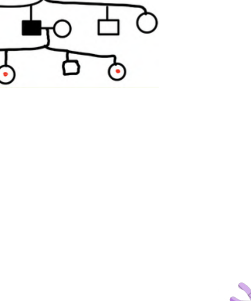

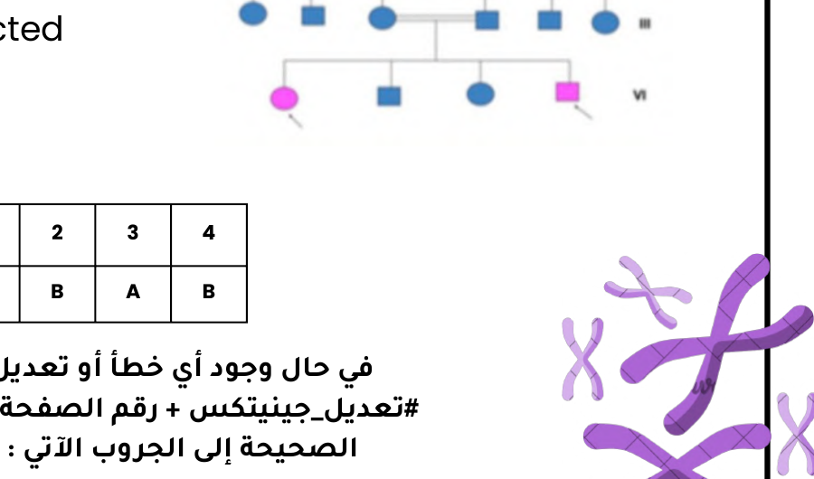

**الشرح:** في حمل بين والدَين ناقلَين (Aa × Aa): 25% AA (طبيعي)، 50% Aa (ناقل غير مصاب)، 25% aa (مصاب). إذن نسبة الناقل = 50%.

---

### Q: Which of the following genetic mechanisms is known to cause Prader–Willi syndrome?
**الإجابة: B) Paternal chromosome 15 deletion**

**الشرح:** من L7: "Loss of paternal contribution of region on chromosome 15 (15q11-q13) → Prader-Willi syndrome." ويمكن أيضاً أن ينتج عن Maternal UPD.

---

### Q: How can Prader-Willi syndrome (PWS) occur?
**الإجابة: A and C صحيحتان:** 
- A) Uniparental disomy of the maternal chromosome (maternal UPD15)
- C) Deletion of the paternal allele in the 15q11-q13 region

**الشرح:** PWS ينتج عن فقدان المساهمة الأبوية لمنطقة 15q11-q13 إما عبر: (1) deletion أبوية، أو (2) UPD أموية.

---

### Q: A 6-year-old male patient with seizure, intellectual disability, inappropriate laughter, microcephaly, unsteady gait, what is the most likely genetic mechanism?
**الإجابة: A) Loss of maternal contribution of region on chromosome 15**

**الشرح:** هذه أعراض Angelman syndrome. من L7: Angelman = فقدان المساهمة الأموية لمنطقة 15q11-q13 (deletion أموية أو UPD أبوية أو طفرة في UBE3A).

---

### Q: One of the following disorders is caused by a genetic imprinting defect leading to developmental delay, seizures, and a happy demeanor:
**الإجابة: B) Angelman syndrome**

**الشرح:** Angelman syndrome: تأخر نمو، نوبات صرع، سعادة غير مبررة (happy demeanor)، صعوبة في الحركة. سببه فقدان التعبير الجيني الأموي لمنطقة 15q11-q13.

---

### Q: A male presents with dysmorphic facial features, almond-shaped eyes, small hands and feet, hyperphagia, short stature, and obesity. What is the most likely diagnosis?
**الإجابة: A) Prader–Willi syndrome**

**الشرح:** السمات الكلاسيكية لـ PWS: عيون باللوز، أيدي وأقدام صغيرة، شهية مفرطة، قصر القامة، سمنة، نقص التوتر العضلي.

---

### Q: A 6-year-old female presents with hyperphagia and short stature. Clinical examination reveals obesity and dysmorphic features, including almond-shaped eyes and small hands and feet. What is the most likely diagnosis?
**الإجابة: B) Prader–Willi syndrome**

---

### Q: The normal individual will have only one transcriptionally active copy of the gene. What is the most common explanation of this process of gene silencing?
**الإجابة: C) Genomic imprinting**

**الشرح:** من L7: Genomic imprinting هو عملية يتم فيها التعبير عن نسخة واحدة من الجين فقط (إما الأبوية أو الأموية) بسبب methylation epigenetic.

---

### Q: Genomic imprinting considered if:
**الإجابة: B) The normal individual has only one transcriptionally active gene**

**الشرح:** هذا هو تعريف Genomic imprinting - يعبّر عن نسخة واحدة فقط من الجين بشكل طبيعي.

---

### Q: Which of the following is an example of genomic imprinting?
**الإجابة: A) Angelman syndrome and Prader-Willi syndrome**

**الشرح:** كلاهما ناتج عن تأثر نفس المنطقة (15q11-q13) لكن بآلية imprinting مختلفة: PWS (فقدان أبوي) وAS (فقدان أموي).

---

### Q: Which of the following describes the presence of two types of mitochondrial DNA (normal and abnormal)?
**الإجابة: C) Heteroplasmy**

**الشرح:** من L7: "If a variant occurs in the mitochondrial DNA of an individual, having a mixture of normal and abnormal mitochondrial DNA → termed heteroplasmy." أما Homoplasmy = كل جزيئات mtDNA متطابقة.

---

### Q: Marfan syndrome is an example of?
**الإجابة: C) Pleiotropy**

**الشرح:** Marfan يؤثر على أنظمة متعددة بسبب جين واحد (FBN1): قلب، عظام، عيون.

---

### Q: Which of the following is true about mitochondrial DNA?
**الإجابة: C) Inherited almost exclusively from the oocyte**

**الشرح:** من L7: "In most persons, the mitochondrial DNA from the sperm is excluded after fertilization → Mitochondrial inheritance is maternal." الـ mtDNA دائري وليس خطياً، ويرمّز لـ 37 جيناً (وليس 70).

---

### Q: From which cell are mitochondrial diseases transmitted to offspring?
**الإجابة: D) Oocyte**

**الشرح:** الميتوكوندريا تنتقل من الأم عبر البويضة. الحيوان المنوي يفقد ميتوكوندرياه بعد الإخصاب.

---

### Q: Which of the following is an example of matrilineal inheritance?
**الإجابة: A) MELAS (Mitochondrial encephalopathy, lactic acidosis, stroke-like episodes)**

**الشرح:** MELAS هو مرض ميتوكوندري ينتقل عبر الأم فقط. Cystic fibrosis = AR، Achondroplasia = AD، Rett = X-linked.

---

### Q: Matrilineal inheritance applies to disorders that are directly due to mutations in which of the following?
**الإجابة: B) Mitochondrial DNA**

---

### Q: Which of the following describes the presence of two or more different chromosomal cell lines within the same individual?
**الإجابة: A) Mosaicism**

**الشرح:** من L7: Mosaicism = وجود خطَّين خلويَّين أو أكثر تختلف في تركيبها الجيني ولكنها نشأت من نفس الـ zygote.

---

### Q: Parents are phenotypically normal but have two children with an autosomal dominant disease. What is the most likely explanation?
**الإجابة: A) Gonadal mosaicism**

**الشرح:** من L7: Gonadal mosaicism = طفرة تحدث في خلايا الجهاز التناسلي فقط، لذلك يبدو الوالدان طبيعيَّين لكنهما يمكن أن ينقلا الطفرة لأكثر من طفل.

---

### Q: The severity of a genetic disease varies among individuals within the same family. What is the most likely explanation?
**الإجابة: C) Variable expressivity**

**الشرح:** Variable expressivity = تباين في شدة التعبير عن نفس الجين بين أفراد العائلة مع نفس الطفرة. (مختلف عن Penetrance الذي يعني وجود/غياب الفينوتايب).

---

### Q: A child is diagnosed with NF1 and presents with multiple café-au-lait spots and optic glioma. His mother also has NF1 but only mild hearing impairment and Lisch nodules. Which genetic concept best explains the difference?
**الإجابة: B) Variable expressivity**

**الشرح:** نفس الطفرة في NF1 لكن بدرجات مختلفة من التعبير الجيني بين الأم والطفل.

---

### Q: A 10-year-old boy came to the genetic clinic. Family history revealed a similarly affected sister. His father and paternal grandmother have moderate manifestations. Why did his father and paternal grandmother develop moderate manifestations?
**الإجابة: B) Variable expression**

---

### Q: What is the recurrence risk per each pregnancy in X-linked dominant inheritance?
**الإجابة: C) 50%**

**الشرح:** في X-linked dominant: المريض المصاب (ذكر أو أنثى) ينقل المرض لـ 50% من أبنائه بصرف النظر عن جنسهم.

---

### Q: An affected male transmits the disease to all of his daughters but none of his sons. This pattern is most consistent with:
**الإجابة: B) X-linked dominant disorders**

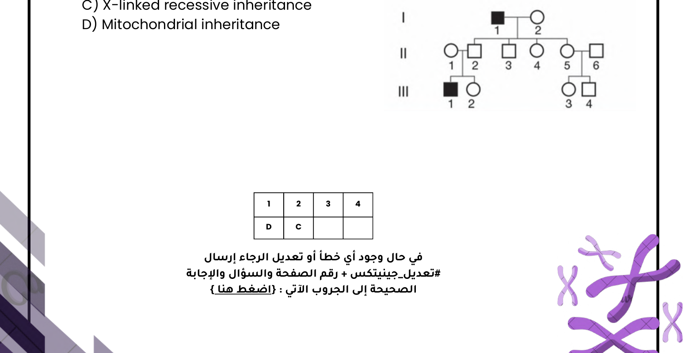

**الشرح:** الأب المصاب بـ X-linked dominant ينقل X المصاب لكل بناته (فيصبحن مصابات) ولا يصل لأبنائه الذكور (يأخذون Y من الأب).

---

### Q: A male (46 chromosomes) is affected with an X-linked dominant disorder and wants to get married. What is the recurrence risk for his children?
**الإجابة: A) All daughters affected, none of the sons affected**

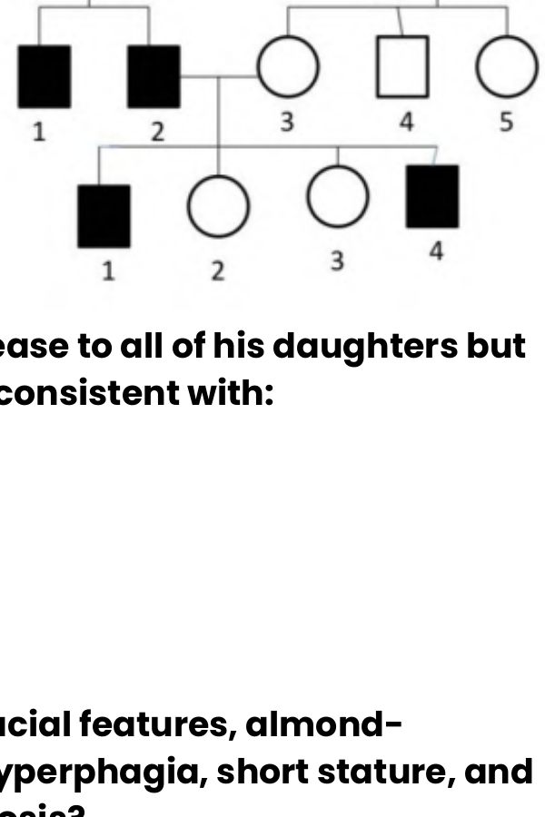

---

### Q: What is the type of disorder is Hypophosphatemic Rickets (Vitamin D resistance rickets)?
**الإجابة: C) X-linked dominant**

**الشرح:** Hypophosphatemic rickets = X-linked dominant. يصيب الإناث والذكور لكن أشد في الذكور في بعض الحالات.

---

### Q: A father is affected with an X-linked dominant disorder. Which of the following is true?
**الإجابة: A) Females are affected as well as males**

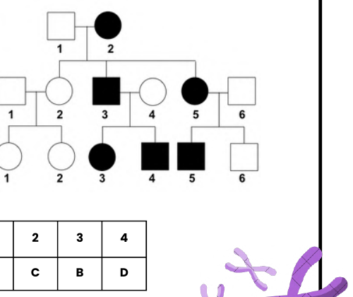

**الشرح:** X-linked dominant يصيب الجنسين، وبنات الأب المصاب كلهن مصابات.

---

### Q: Which of the following describes the presence of two or more different chromosomal cell lines?
**الإجابة: A) Mosaicism**

---

### Q: What is the recurrence risk in autosomal dominant inheritance?
**الإجابة: 50% per each pregnancy**

---

### Q: A family with a 6-year-old girl and a 4-year-old boy, both with a well-known genetic disease. The Father and Paternal grandmother manifest the same disease.
- Mode of inheritance: **Autosomal Dominant**
- Recurrence risk: **50% per pregnancy**
- 2 criteria: Does not skip generations; Both males and females affected equally

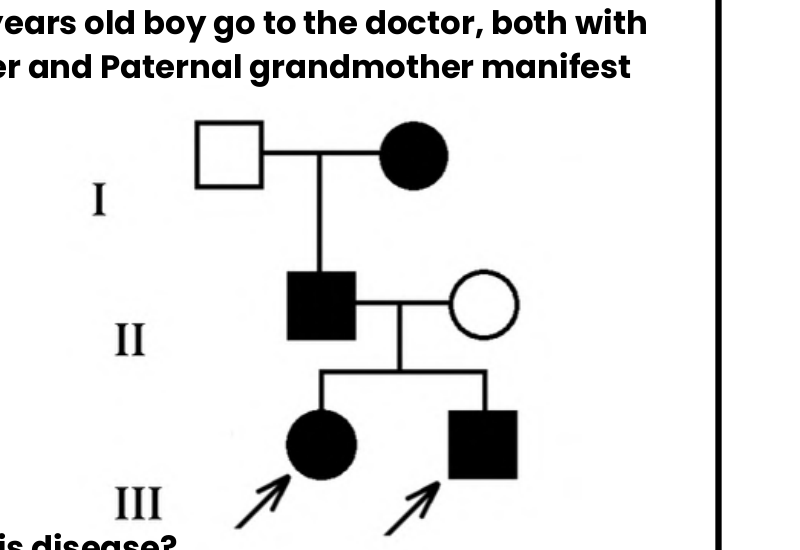

---

### Q: A 3-year-old boy diagnosed with cystic fibrosis. Parents are first cousins. What is the mode of inheritance?
**الإجابة: Autosomal Recessive**
**Recurrence risk: 25% per each pregnancy**

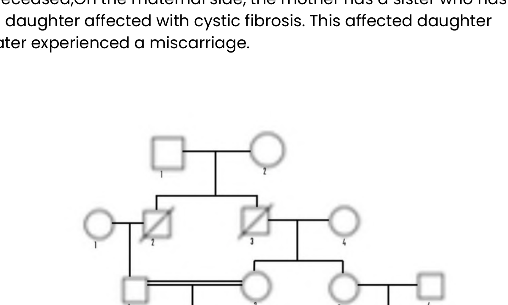

---

### Q: Nada and Mahmoud are consanguineous parents with a child that has sickle cell anemia.
- Recurrence risk per pregnancy: **25%**
- Risk percentage for a carrier: **50%**

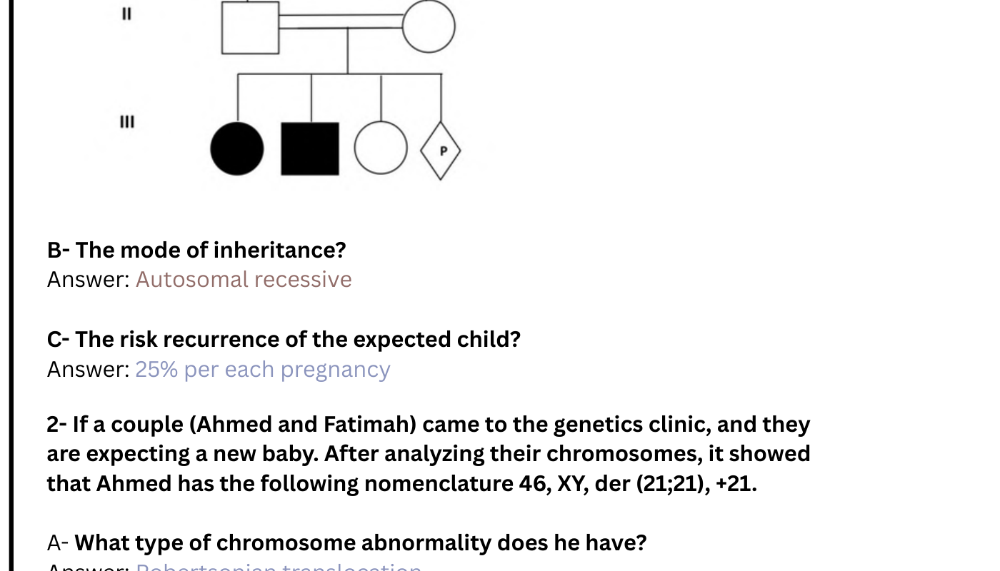

---

### Q: A child presents with anemia and episodic pain...parents are first cousins.
- Diagnosis: **Sickle cell anemia**
- Mode of inheritance: **Autosomal recessive**
- Recurrence risk: **25% per pregnancy**

---

### Q: There was a family with a child diagnosed with sickle cell anemia. What is the recurrence risk?

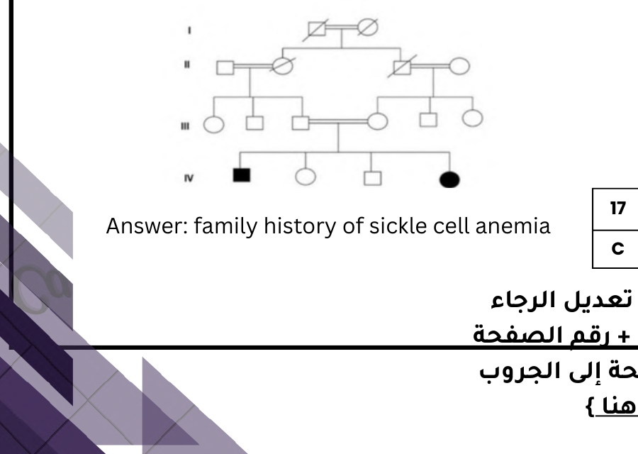
**الإجابة: D) 50% Affected** ← (خطأ في الصياغة، الصحيح 25% affected) 
**ملاحظة:** الإجابة الصحيحة علمياً هي 25% affected. قد يكون في السؤال خطأ، أو المقصود من ناقلَين × ناقل.

---

### Q: Adel, 10-year-old boy with dysmorphic facies and mental retardation. Maternal uncle similarly affected. Maternal grandmother is a carrier of DMD.
- Mode of inheritance: **X-linked recessive**
- Risk to the mother's fetus: 50% carrier female / 50% unaffected female / 50% affected male / 50% unaffected male

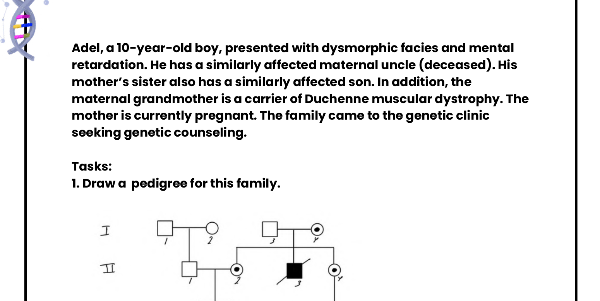

---

### Q: 8-year-old male with muscle weakness, pseudo-hypertrophy of calf muscle. Maternal uncle has same symptoms.
- Diagnosis: **Duchenne Muscular Dystrophy**
- Mode: **X-linked recessive**
- Recurrence risk: 50% affected male, 50% carrier female

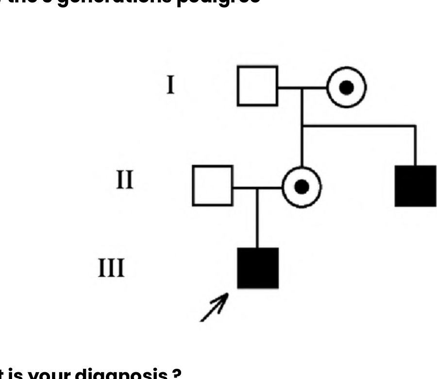

---

### Q: A child presents with muscle weakness, neurological symptoms, affecting multiple siblings from the same mother. Father is unaffected.
**الإجابة: D) Mitochondrial inheritance**

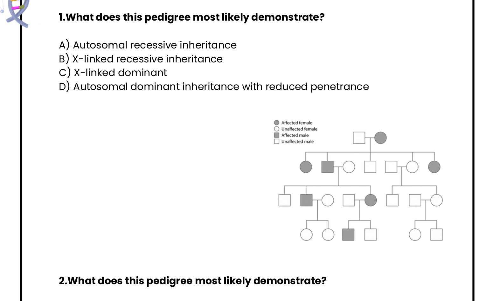

**الشرح:** الانتقال من الأم فقط، الأب غير مصاب ولا يورّث = Mitochondrial inheritance.

---

### Q: Which of the following is correct about Autosomal recessive trait?
**الإجابة: D) Skip generations**

**الشرح:** AR يمكن أن يتخطى الأجيال لأن الناقلين لا يُظهرون المرض.

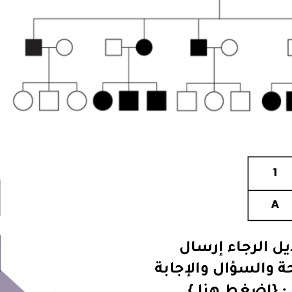

---

### Q: In autosomal recessive inheritance, what is the chance of being heterozygous unaffected (carrier)?
**الإجابة: B) 50%**

---

---

## 📚 L2 — Chromosomes: Normal Structure (بنية الكروموسومات)

---

### Q: What is the number of autosomes in a male gamete?
**الإجابة: C) 22**

**الشرح:** من L2: الخلية الجرثومية (gamete) تحتوي على 23 كروموسوماً: 22 autosome + 1 sex chromosome (X أو Y). إذن عدد الـ autosomes في الخلية الجرثومية = 22.

---

### Q: What is the normal karyotype of a healthy female?
**الإجابة: D) 46,XX**

**الشرح:** الأنثى الطبيعية: 46,XX. الذكر الطبيعي: 46,XY. (L2)

---

### Q: Which of the following chromosomes is classified as metacentric?
**الإجابة: C) Chromosome 3**

**الشرح:** من L2: "Metacentric chromosomes: 1, 3, 16, 19, 20" — الكروموسوم مركزي عندما يكون الـ centromere في المنتصف (p arm ≈ q arm).

---

### Q: What is the primary function of the centromere?
**الإجابة: C) To allow attachment of spindle microtubules during cell division**

**الشرح:** من L2: الـ centromere يتصل بخيوط المغزل (spindle microtubules) أثناء الانقسام الخلوي لضمان توزيع الكروموسومات بشكل صحيح على الخلايا الوليدة.

---

### Q: Which chromosome is considered a satellite chromosome?
**الإجابة: D) Chromosome 14**

**الشرح:** الكروموسومات الـ acrocentric (13, 14, 15, 21, 22) تحتوي على satellites (بُنى صغيرة تشبه الملحق) عند الذراع القصير. كروموسوم 14 من هذه المجموعة.

---

### Q: Which chromosome has an appendage-like structure (satellite)?
**الإجابة: C) Chromosome 14**

**الشرح:** الـ satellites موجودة على الكروموسومات الـ acrocentric: 13, 14, 15, 21, 22.

---

### Q: What does the cytogenetic notation 7q15 indicate?
**الإجابة: D) Chromosome 7 long arm, first region, fifth band**

**الشرح:** من L2: q = الذراع الطويل (long arm)، 1 = region 1، 5 = band 5. إذن 7q15 = كروموسوم 7، الذراع الطويل، المنطقة 1، الحزمة 5.

---

### Q: Loss of the paternal chromosome segment 15q11–q13 leads to which condition?
**الإجابة: D) Prader-Willi syndrome**

**الشرح:** من L7: Prader-Willi = فقدان المساهمة الأبوية لمنطقة 15q11-q13. Angelman = فقدان المساهمة الأموية لنفس المنطقة.

---

### Q: Which enzyme is responsible for unwinding DNA during replication?
**الإجابة: D) Helicase**

**الشرح:** من L3: "Helicase; facilitates the unwinding of the parent DNA strand." أما Ligase يربط، DNA polymerase يضيف nucleotides، RNA polymerase يصنع RNA.

---

### Q: A chromosome ideogram shows bands. Which region is closest to the telomere?
**الإجابة: D) Xq28**

**الشرح:** كلما ارتفع رقم الحزمة

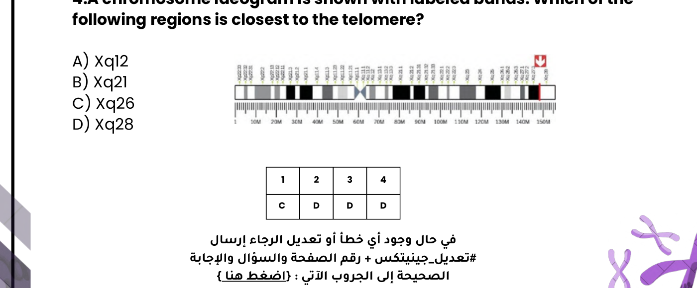
 كلما كان أبعد عن الـ centromere وأقرب للـ telomere. إذن Xq28 > Xq26 > Xq21 > Xq12.

---

### Q: What is responsible for the integrity of the chromosome during the cell cycle and its loss would result in the formation of a ring chromosome?
**الإجابة: C) Telomeres**

**الشرح:** من L2: "Telomeres play a crucial role in sealing the ends of chromosomes." فقدان الـ telomeres يؤدي إلى التصاق نهايات الكروموسومات معاً مما يشكّل ring chromosome.

---

### Q: Regarding the cell cycle, the resting phase is?
**الإجابة: B) Interphase**

**الشرح:** الـ Interphase هي المرحلة بين الانقسامات الخلوية وتشمل G1, S, G2. في هذه المرحلة تستعد الخلية للانقسام وتنسخ DNA.

---

### Q: Which of the following is true about mitosis?
**الإجابة: B) Division of centromere and chromatids will separate during anaphase**

**الشرح:** في Anaphase للـ Mitosis، يتقسم الـ centromere وتنفصل الـ chromatids. في Meiosis I تنفصل أزواج الكروموسومات.

---

### Q: Mitosis is the process of nuclear division that occurs during the final stage of gamete formation. (True/False)
**الإجابة: False**

**الشرح:** تكوين الأمشاج (gametes) يتم عبر Meiosis وليس Mitosis.

---

### Q: Give the definition of homologous chromosome:
**الإجابة: B) A chromosome of the same size and shape which carries the same type of genes**

**الشرح:** الكروموسومات المتماثلة (homologous chromosomes) تتشابه في الحجم والشكل وتحمل نفس أنواع الجينات (لكن قد تكون alleles مختلفة).

---

### Q: Give the definition of Ring chromosome:
**الإجابة: D) A structurally abnormal chromosome in which the ends of each chromosome arm have been lost and the broken arms have been reunited to form a ring**

---

### Q: When a chromosome divides transversely at the centromere instead of along its length, it results in...
**الإجابة: Isochromosome**

**الشرح:** الـ Isochromosome يتكون عندما ينقسم الـ centromere عرضياً بدلاً من طولياً، مما يُنتج كروموسوماً يحمل إما ذراعَين قصيرتَين متطابقتَين أو ذراعَين طويلتَين متطابقتَين.

---

### Q: Concerning the centromere position, chromosome 3 is considered a ______ chromosome.
**الإجابة: Metacentric**

---

### Q: Chromosomes can be identified by their thickness. (True/False)
**الإجابة: False**

**الشرح:** تُعرَّف الكروموسومات بـ: الحجم (size)، نمط الحزم (banding pattern)، وموضع الـ centromere. ليس بالسماكة.

---

### Q: Any nucleated cells can be used to make karyotype?
**الإجابة: True** (من L2)

**ملاحظة:** لكن في الممارسة يُستخدم دم الوريد (lymphocytes) أو خلايا السائل الأمنيوسي أو نخاع العظم.

---

### Q: Which of the following samples is suitable for karyotype analysis?
**الإجابة: A) Peripheral blood**

**الشرح:** الدم المحيطي (lymphocytes) هو المصدر الأكثر استخداماً للتحليل الكروموسومي. البول والريق والبراز لا تُستخدم عادةً.

---

### Q: Which cell can't be used for chromosomal analysis?
**الإجابة: D) RBCs (Red Blood Cells)**

**الشرح:** كريات الدم الحمراء الناضجة لا تحتوي على نواة، لذلك لا يمكن تحليل كروموسوماتها. أما WBCs وخلايا الجلد والكبد فلها أنوية.

---

---

## 📚 L3 — Central Dogma of Molecular Biology (العقيدة المركزية)

---

### Q: Where does protein synthesis occur in the cell?
**الإجابة: B) Ribosome**

**الشرح:** من L3: "Ribosomes" هي موقع ترجمة mRNA إلى بروتين. النواة موقع النسخ (transcription) وليس الترجمة.

---

### Q: During which process is mRNA produced?
**الإجابة: D) Transcription**

**الشرح:** من L3: المعلومة الجينية تسير: DNA → RNA (عبر Transcription) → Protein (عبر Translation). mRNA تُنتج أثناء Transcription.

---

### Q: What are the main structural components of a gene?
**الإجابة: C) Exons, introns, and regulatory sequences such as promoters**

**الشرح:** من L1: "Genes are made up of promoter regions and alternating regions of introns (noncoding sequences) and exons (coding sequences)."

---

### Q: The addition of a poly-A tail to mRNA serves which of the following functions?
**الإجابة: A) Protects mRNA from degradation**

**الشرح:** الـ poly-A tail (ذيل الـ poly-A) في نهاية الـ 3' من mRNA يحمي الـ mRNA من التحلل الإنزيمي ويساعد في نقله من النواة.

---

### Q: Which is the sequence of poly-A tail that is attached to mRNA?
**الإجابة: A) AAUAAA**

**الشرح:** AAUAAA هي إشارة الـ polyadenylation التي تُشير إلى مكان إضافة الـ poly-A tail. (ملاحظة: AATAAA هي نفس التسلسل في DNA، AAUAAA في RNA)

---

### Q: The mRNA sequence TAG TAG TAG. If we add cytosine at the beginning, what will be the new sequence?
**الإجابة: A) CTA GTA GTAG**

**الشرح:** إضافة C في البداية تُحرك إطار القراءة (reading frame shift): CTA-GTA-GTA-G. هذا مثال على frameshift mutation.

---

### Q: It has been recently determined that the gene for DMD is over 2000 kb in length, however the mRNA produced is only about 14 kb. What is a likely cause?
**الإجابة: B) Spliced out of the introns during mRNA processing**

**الشرح:** الـ introns تُزال (spliced out) أثناء معالجة mRNA في النواة، مما يُنتج mRNA أقصر بكثير من الجين الأصلي.

---

### Q: What are the components required for DNA replication?
من L3: Template DNA + Free nucleotides + Primers + Enzymes (Helicase, DNA polymerase, Topoisomerase, Ligase)

---

### Q: What is DNA polymerase's role?
**الشرح:** من L3: DNA polymerase يضيف النيوكليوتيدات الجديدة للسلسلة النامية بالاتجاه 5' إلى 3'. يحتاج primer للبدء.

---

### Q: What enzyme is used to unwind the double helix of DNA? (in context of FISH/L3 question)
**الإجابة: C) Helicase**

---

### Q: What is the Okazaki fragment?
**الشرح:** من L3: "Short, discontinuous DNA segments synthesized on the lagging strand during DNA replication" — تتكون بسبب أن التوليف يسير دائماً بالاتجاه 5'→3' بينما اللولب يُفك باتجاه معاكس.

---

### Q: Which of the following is NOT CORRECT about translation elongation?
**الإجابة: D) 3' end of the tRNA**

**الشرح:** الـ tRNA يحمل الحمض الأميني عند نهاية الـ 3' (وليس 5')، وهذا ليس خطأً في الترجمة. السؤال يطلب ما هو غير صحيح في الرسم البياني — يعتمد على الصورة المرفقة. ⚠️ يحتاج صورة

---

### Q: Which of the following statements is not correct regarding the genetic code?
**الإجابة: D) It is not universal for all organisms**

**الشرح:** الرمز الجيني (genetic code) هو universal (عالمي) — نفس الكودونات تُرمز لنفس الأحماض الأمينية في معظم الكائنات.

---

---

## 📚 L4 — Chromosomes and Their Disorders (اضطرابات الكروموسومات)

---

### Q: What is the definition of translocation?
**الإجابة: C) Exchange of genetic material between non-homologous chromosomes**

**الشرح:** الـ Translocation = انتقال قطعة من كروموسوم إلى كروموسوم آخر غير متماثل. Reciprocal translocation = تبادل متبادل، Robertsonian = التصاق كروموسومين acrocentric عند الـ centromere.

---

### Q: 46,XY, t(7;11) — What does this mean?
**الإجابة: A) Male with reciprocal translocation between chromosome 7 and chromosome 11**

**الشرح:** t = translocation، (7;11) = بين كروموسوم 7 و11، 46,XY = ذكر بـ 46 كروموسوم → balanced reciprocal translocation.

---

### Q: What is a characteristic of balanced translocation?
**الإجابة: A) No change in gene dose**

**الشرح:** Balanced translocation = المادة الجينية انتقلت لكن لم تُفقد ولم تُضاعف → لا يوجد تغيير في جرعة الجينات → الفرد عادةً طبيعي فينوتيبياً.

---

### Q: Which of the following represents deletion of short arm of chromosome 10 in male?
**الإجابة: B) 46,XY,del(10)(p11.2p23)**

**الشرح:** p = short arm، 46,XY = ذكر، del = deletion، (p11.2p23) = نقطتا الكسر على الذراع القصير.

---

### Q: A male with deletion on chromosome 15 of long arm region 1 band 3 — correct notation:
**الإجابة: B) 46,XY,del(15)(q13)**

**الشرح:** q = long arm، 1 = region 1، 3 = band 3 → q13.

---

### Q: What is the most common cause of Turner syndrome?
**الإجابة: A) Monosomy X (45,X)**

**الشرح:** Turner syndrome يُسبَّب في 50% من الحالات بـ 45,X (monosomy X) الناتجة عن nondisjunction. الأسباب الأخرى: isochromosome Xq، ring X، mosaicism.

---

### Q: The most common numerical cause of Turner syndrome is?
**الإجابة: D) 45,X**

---

### Q: The following chart shows the stature of a 13-year-old girl with primary amenorrhea, congenital heart disease and webbed neck. What is the diagnosis?
**الإجابة: Turner Syndrome**
- Karyotype: 45,X
- Aberration: X chromosome aberration

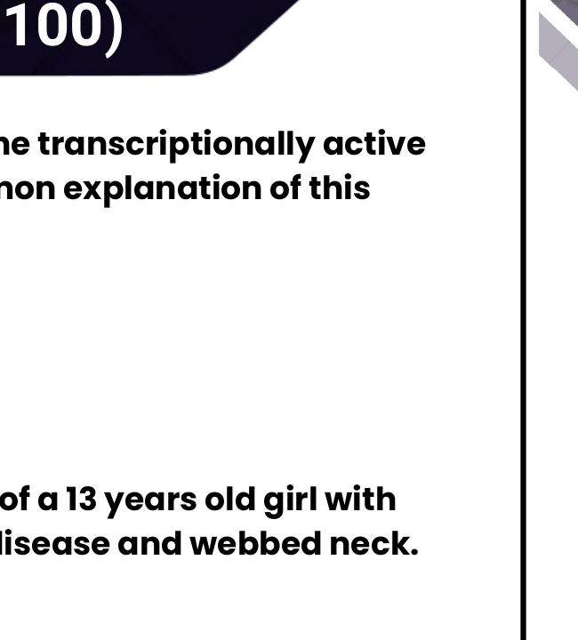

---

### Q: A karyotype shows a ring X chromosome. Identify the disorder:
**الإجابة: C) Turner syndrome**

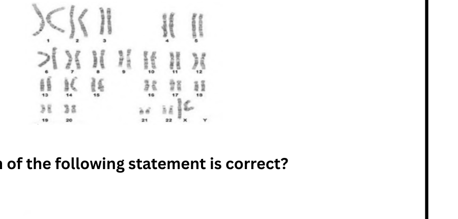

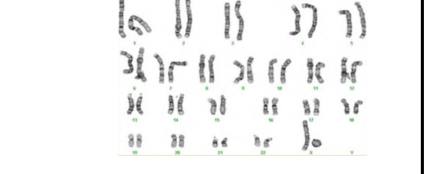

**الشرح:** Ring X chromosome (46,X,r(X)) هو أحد التغيرات البنيوية المرتبطة بـ Turner syndrome.

---

### Q: What is the following karyotype: 46,X,isoXq?
**الإجابة: C) 46,X,i(Xq) — Isochromosome of Xq → Turner syndrome**

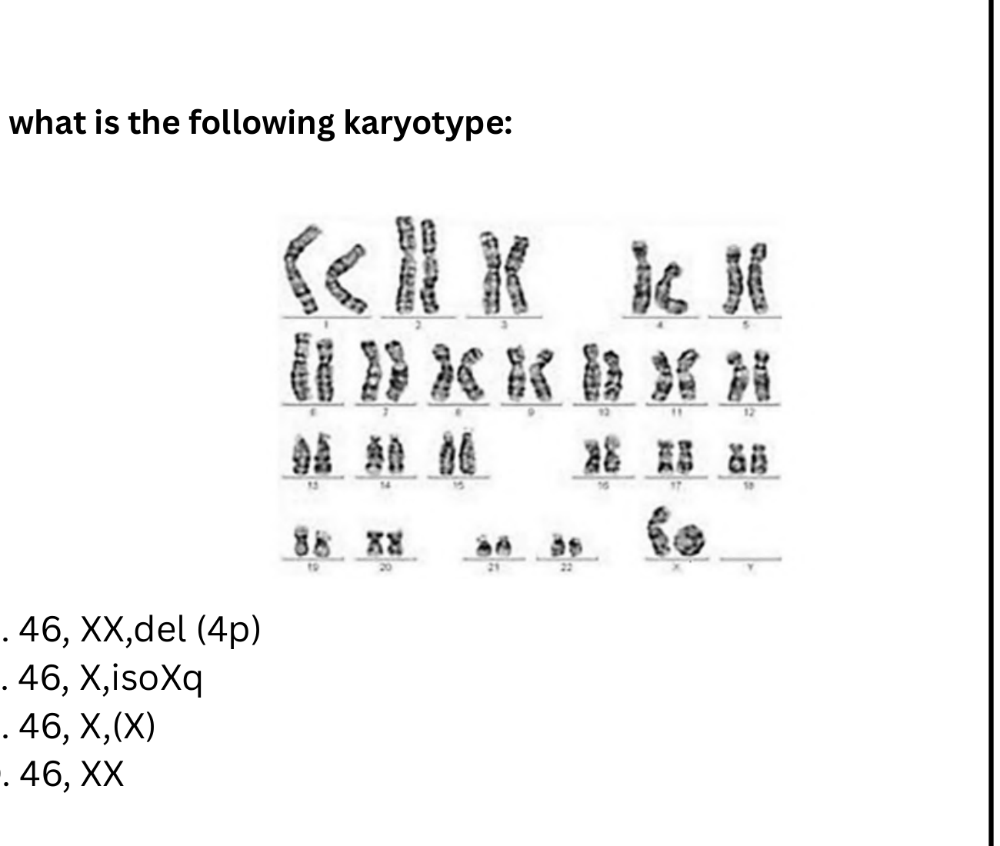

**الشرح:** Isochromosome Xq = فقدان الذراع القصير مع تضاعف الذراع الطويل لـ X. يُسبب Turner syndrome.

---

### Q: Which of the following conditions is characterized by the presence of two or more different chromosomal cell lines within the same individual?
**الإجابة: A) Mosaicism**

---

### Q: What does this karyotype show? (Klinefelter karyogram)
**الإجابة: B) Klinefelter syndrome (47,XXY)**

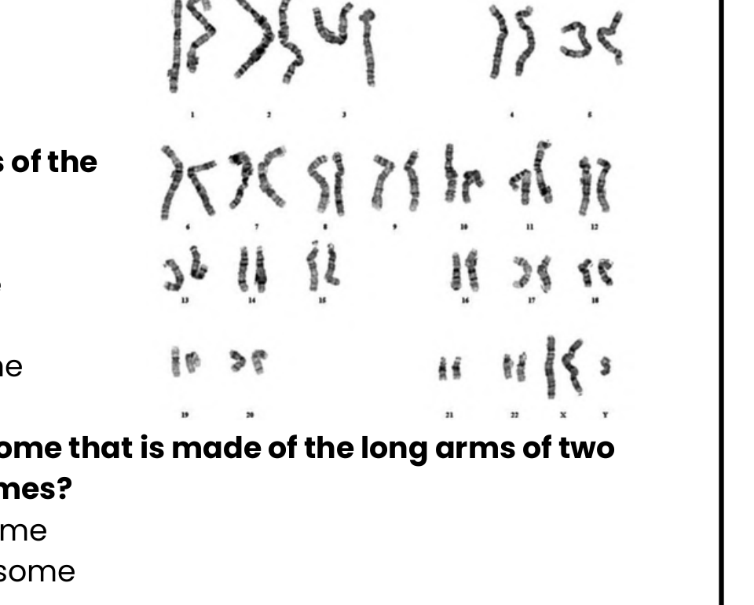

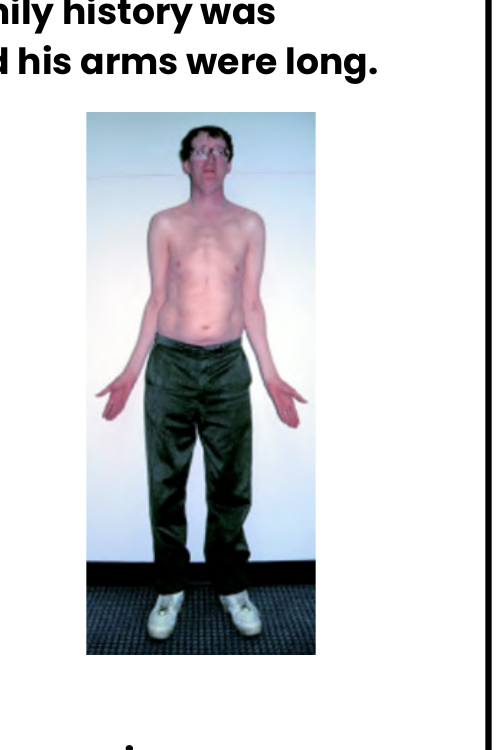

**الشرح:** Klinefelter = ذكور بكروموسوم X زائد. المميزات: عقم، gynecomastia، طول القامة، مستوى testosterone منخفض.

---

### Q: All the following are trisomies EXCEPT:
**الإجابة: C) Turner syndrome**

**الشرح:** Turner syndrome = monosomy X (45,X) وليس trisomy. Patau = trisomy 13، Down = trisomy 21، Edwards = trisomy 18.

---

### Q: Risk of having a Down syndrome child — when mother has 45,t(14;21):
**الإجابة: C) 10-15%**

**الشرح:** عندما تكون الأم ناقلة لـ Robertsonian translocation بين 14 و21، فإن خطر إنجاب طفل مصاب بـ Down syndrome يكون 10-15%.

---

### Q: Carrier female with rob(14;21), what is the recurrence risk for Down syndrome?
**الإجابة: A) 10-15%**

---

### Q: A female was in the clinic with her daughter, her daughter was 47,t(14;21)+21. Her mother was diagnosed with 45,t(14;21). What is the percentage for the next birth to be affected?
**الإجابة: C) 10-15%**

---

### Q: Mustafa and Fatima: baby with 46,XY,t(21;21)+21. Cytogenetic analysis for Fatima shows the same Robertsonian translocation. What is the recurrence risk?
**الإجابة: E) 100%**

**الشرح:** عندما يكون أحد الوالدين يحمل rob(21;21) فإن كل البويضات/الحيوانات المنوية ستحتوي على كروموسوم 21 مزدوج → خطر 100% لـ Down syndrome أو miscarriage.

---

### Q: If a couple came to genetics clinic. Ahmed has 46,XY,der(21;21),+21:
- Type of chromosome abnormality: **Robertsonian translocation**
- Balanced? **No** (لأن لديه +21 الزائد)
- Type for baby: **Down syndrome, 100% per each pregnancy**

---

### Q: A karyotype of female Down syndrome:
**الإجابة: A) 46,XX,rob(14;21)+21**

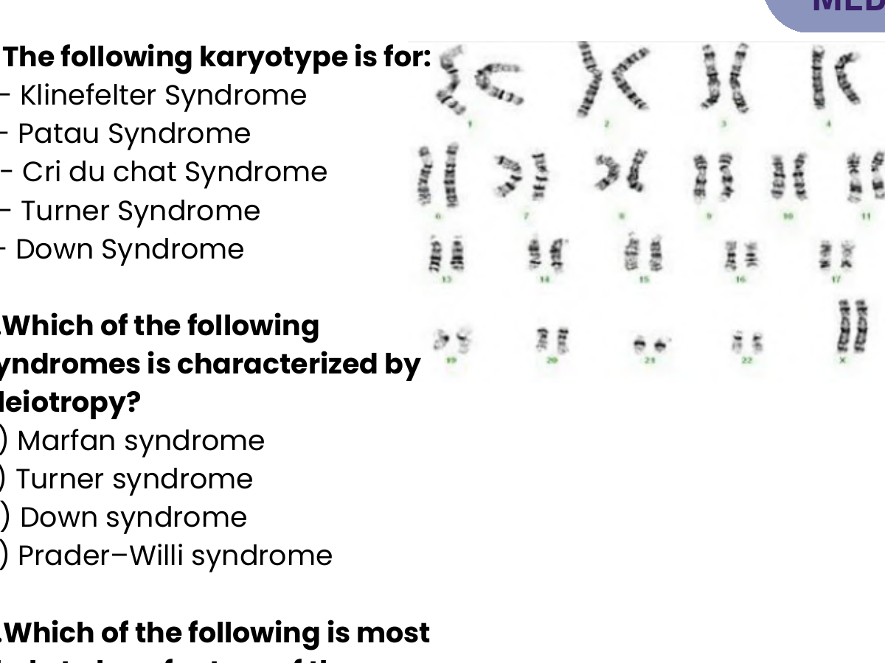

**الشرح:** Down syndrome بسبب Robertsonian translocation بين 14 و21 في أنثى.

---

### Q: Which of the following is a suitable nomenclature for Robertsonian translocation (karyotype showing rob 14;21)?
**الإجابة: D) 45,XX,rob(14;21)(q10,q10)**

**الشرح:** Robertsonian translocation يُنتج 45 كروموسوماً (لأن الكروموسومَين يندمجان). الترميز: rob مع تحديد نقطتَي الكسر.

---

### Q: 46,XY, t(4;6), (p12;q14) — How is it named?
**الإجابة: B) Reciprocal translocation between chromosome number 4 and 6**

**الشرح:** t = reciprocal translocation، (4;6) = الكروموسومات المتبادلة، (p12;q14) = نقطتا الكسر.

---

### Q: In FISH testing, how is a microdeletion detected?
**الإجابة: A) By specific chromosome stain** (= specific locus probe)

**الشرح:** في FISH، يُستخدم probe محدد للمنطقة المشتبه بحذفها. غياب الإشارة الفلورية يدل على الحذف.

---

### Q: What is the probe of FISH used for microdeletion and duplication?
**الإجابة: A) Specific locus**

**الشرح:** من L13: لاكتشاف الـ microdeletion والـ microduplication يُستخدم Specific locus probe. Centromeric probe لعد الكروموسومات، Whole painting probe لتمييز الكروموسومات كاملة.

---

### Q: Which technique would be used in recurrent miscarriages?
**الإجابة: A) Karyotyping**

**الشرح:** الإجهاض المتكرر غالباً مرتبط بـ balanced translocations في أحد الوالدين. Karyotyping هو الأنسب لاكتشاف هذه التغيرات البنيوية.

---

### Q: Which of the following is most commonly detected by cytogenetic testing?
**الإجابة: A) Balanced translocation**

**الشرح:** Traditional karyotyping (G-banding) يكتشف: balanced translocation، تغيرات عددية كبيرة، inversions. لا يكتشف: point mutations، microdeletions < 5Mb، triplet repeats.

---

### Q: What is the most common cause of triploidy?
**الإجابة: A) Fertilization of an egg by two sperm (Dispermy)**

**الشرح:** الـ Triploidy (69 كروموسوم) ينتج في معظم الحالات من تلقيح بويضة واحدة بحيوانين منويَّين.

---

### Q: Which one of these causes triploidy?
**الإجابة: B) Fertilization of abnormal 2n ova with normal sperm**

**الشرح:** هذا سبب آخر للـ triploidy: البويضة الثنائية (2n) × حيوان منوي طبيعي (n) = 3n.

---

### Q: What does the following karyotype show? (69 chromosomes shown)
**الإجابة: B) Aneuploidy** (أو Triploidy حسب صياغة السؤال)

**ملاحظة:** إذا أظهرت الصورة 69 كروموسوماً → Triploidy.

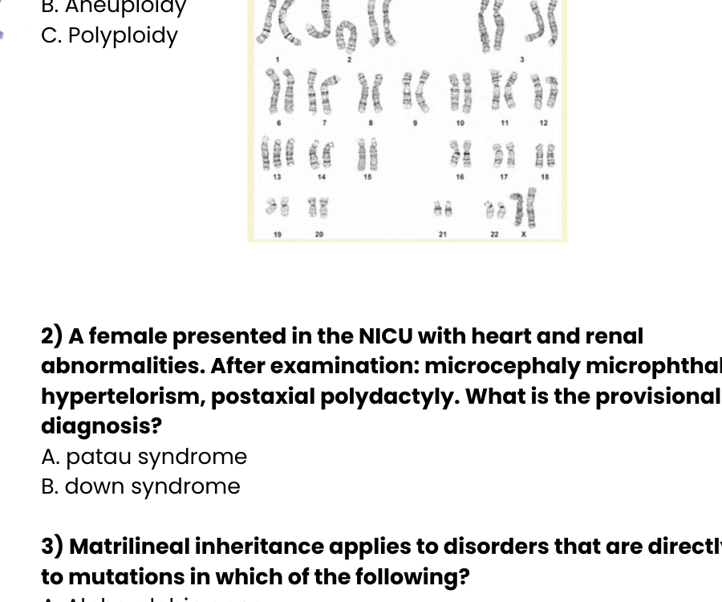

---

### Q: When breaks occur on each arm of a chromosome and the segment between the breaks is reconstituted — type of rearrangement?
**الإجابة: C) Paracentric inversion** أو **B) Pericentric inversion** حسب موضع الـ centromere

**الشرح:**
- Pericentric inversion: الكسران يحدثان في ذراعَي الكروموسوم (يشمل الـ centromere)
- Paracentric inversion: الكسران في نفس الذراع (لا يشمل الـ centromere)
- Ring chromosome: الكسران في طرفَي الكروموسوم مع التصاقهما

**الإجابة المطلوبة (حسب السؤال):** B) Pericentric inversion (breaks on each ARM = يشمل centromere)

---

### Q: What is the term for a double break in the short arm of a chromosome, replaced in the region between the breaks inverted?
**الإجابة: C) Paracentric inversion**

**الشرح:** الكسران في الذراع القصير فقط (ليس عبر centromere) = Paracentric inversion.

---

### Q: In FISH testing for microdeletion (DiGeorge 22q11.2):
**الشرح:** يُستخدم specific locus probe لمنطقة 22q11.2. إذا كانت الإشارة الفلورية تظهر على نسخة واحدة فقط = microdeletion.

---

### Q: A female came to the hospital, pregnant. Doctor told her son suffers from unbalanced rearrangement. What could it be?
**الإجابة: C) Deletion**

**الشرح:** Unbalanced rearrangement = فقدان أو زيادة في المادة الجينية، كالـ deletion أو الكروموسوم المشتق (derivative) غير المتوازن.

---

### Q: A child presents with Microcephaly, hypotonia, and cat-like cry. What would chromosomal analysis show?
**الإجابة: A) 5p deletion**

**الشرح:** Cri-du-chat syndrome (صرخة القطة) = حذف الذراع القصير لكروموسوم 5 → del(5)(p15). المميزات: microcephaly، صرخة شبيهة بصوت القطة، تأخر نمو.

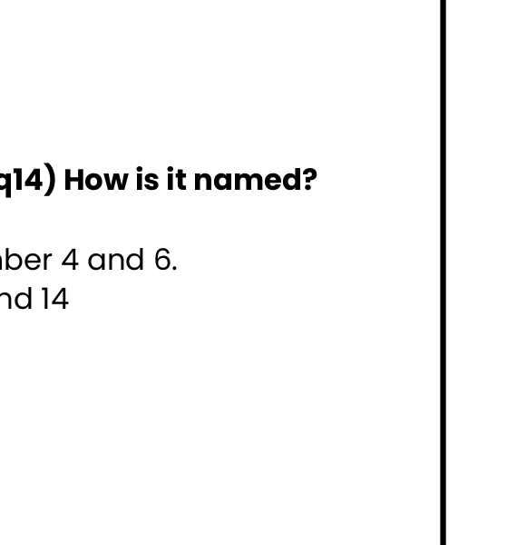

---

### Q: The karyogram below shows (Cri-du-chat, answer about 5p deletion):
**الإجابة: C) It involves single break of 5p in the terminal part and leads to chromosomal loss**

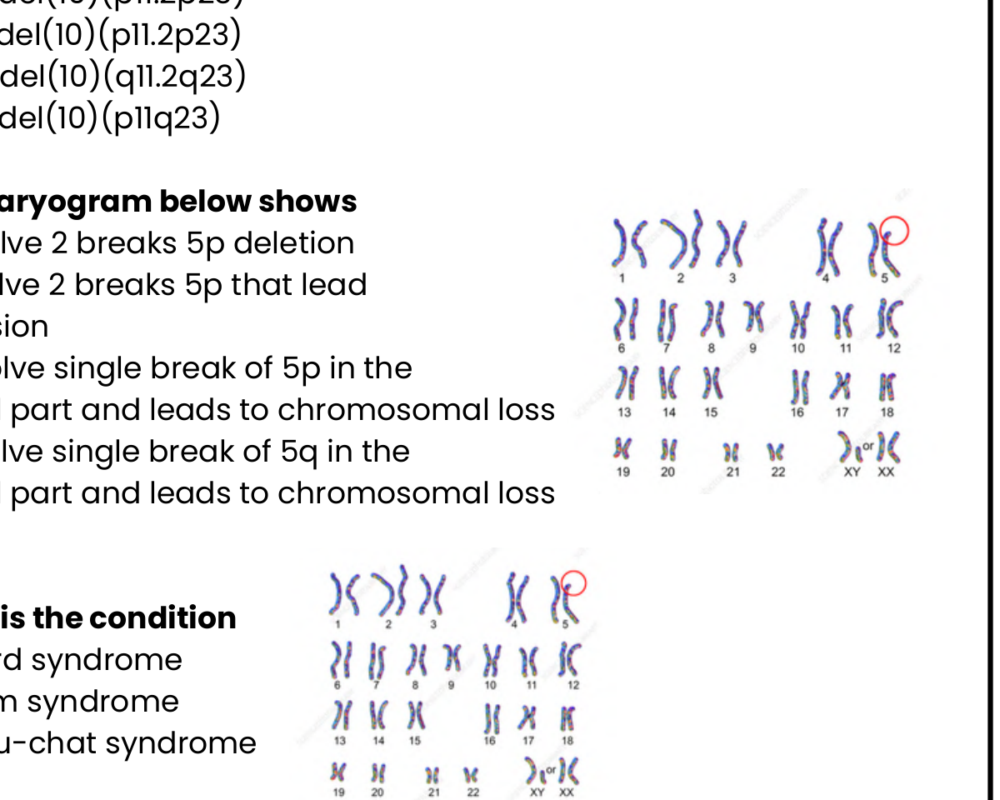

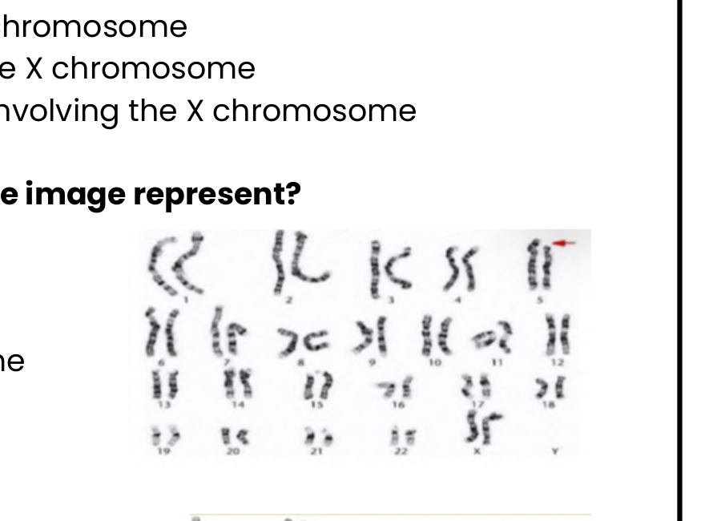

---

### Q: What is the condition? (5p deletion features shown)
**الإجابة: C) Cri-du-chat syndrome**

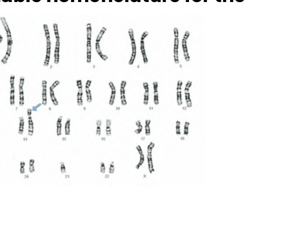

---

### Q: A karyotype shows del(5)(p15) — diagnosis:
**الإجابة: Cri du Chat Syndrome — 46,XY,del(5)(p15) (5p- syndrome)**

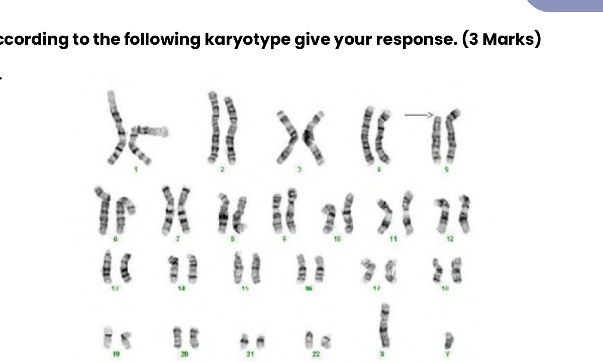

---

### Q: According to the karyotype (Trisomy 13):
**الإجابة: Trisomy 13 (Patau's syndrome) — 47,XY,+13**

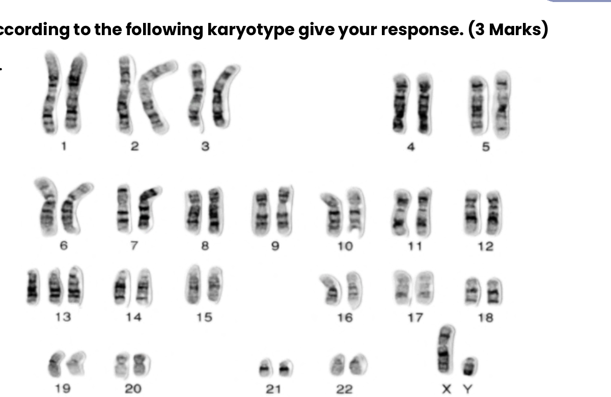

---

### Q: According to the karyotype (Turner):
**الإجابة: Turner's syndrome — 45,X**

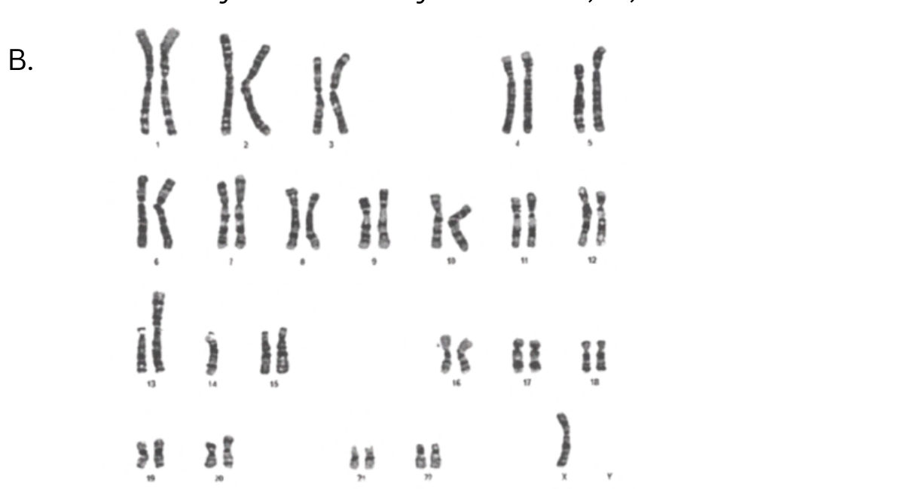

---

### Q: A female presented in NICU with heart and renal abnormalities. Microcephaly, microphthalmia, hypertelorism, postaxial polydactyly. Provisional diagnosis?
**الإجابة: A) Patau syndrome (Trisomy 13)**

**الشرح:** Patau syndrome: microcephaly، polydactyly، cleft lip/palate، heart defects، microphthalmia، holoprosencephaly. Trisomy 13.

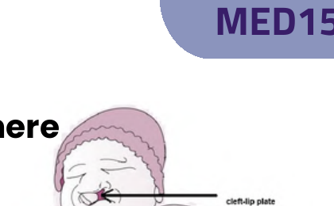

---

### Q: A newborn is in NICU with heart and renal abnormalities, microcephaly, microphthalmia, hypertelorism, postaxial polydactyly. What is the provisional diagnosis?
**الإجابة: A) Patau syndrome**

---

### Q: Polydactyly is a unique feature of which of the following disorders?
**الإجابة: A) Patau syndrome**

**الشرح:** Postaxial polydactyly من السمات المميزة لـ Patau syndrome (trisomy 13). لا توجد في Cri du chat أو Down syndrome.

---

### Q: Fragile X Syndrome is caused by:
**الإجابة: C) Expansion of CGG repeats > 200**

**الشرح:** من L7: FMR1 gene، CGG repeats: Normal 5-44، Pre-mutation 55-200، Full mutation > 200. يُسبب X-linked intellectual disability.

---

### Q: A male came with intellectual disability, long face, protruded ears. Genetic testing showed mutation in FMR1. What is the mode of inheritance?
**الإجابة: A) X-linked**

**الشرح:** Fragile X syndrome = X-linked trinucleotide repeat disorder في جين FMR1 على كروموسوم X.

---

### Q: A male with FMR1 mutation — to see if inherited or new mutation, what should we ask?
**الإجابة: A) Genetic testing for the mother**

**الشرح:** الأم هي المصدر المحتمل للطفرة في الأمراض X-linked. الأب يعطي الابن Y وليس X.

---

### Q: A 30-year-old female has ovarian insufficiency. Son has ear problems. Father (65 years) has tremor. What describes their conditions?
**الإجابة: A) The father is a carrier for pre-mutation (80 repeats of CGG), the son has a mutation of more than 200 repeats**

**الشرح:** هذا يصف FMR1 Fragile X spectrum: الجد يعاني من Fragile X–associated tremor/ataxia syndrome (FXTAS) بسبب pre-mutation، والأم تعاني من Fragile X–associated primary ovarian insufficiency (FXPOI)، والابن لديه full mutation (> 200 repeats).

---

### Q: The pedigree is consistent with one of the following disorders: G6PD deficiency (pedigree showing X-linked pattern)
**الإجابة: C) G6PD deficiency**

**الشرح:** G6PD deficiency = X-linked recessive. يصيب الذكور بشكل رئيسي، الإناث غالباً ناقلات.

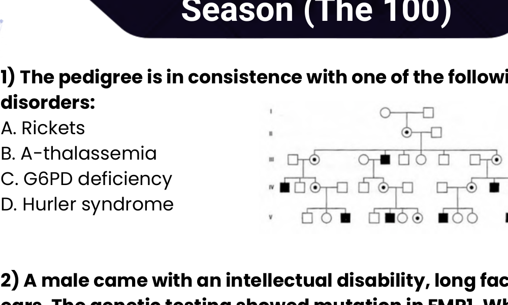

---

### Q: In the following diagram, what chromosomal abnormality is shown? (showing deletion)
**الإجابة: D) Deletion**

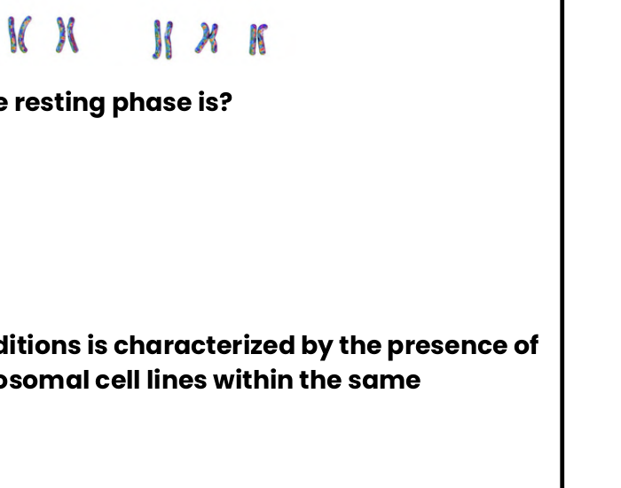

---

### Q: What is demonstrated in the image below? (showing deletion in chromosome)
**الإجابة: A) Deletion**

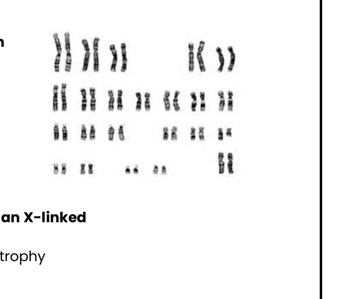

---

### Q: Uniparental disomy of the maternal chromosome (UPD) — context:
**الشرح:** Uniparental disomy = الحصول على كلا نسختَي كروموسوم معين من نفس الوالد.
- Maternal UPD15 → Prader-Willi syndrome
- Paternal UPD15 → Angelman syndrome

---

### Q: Which of the following terms describes the inheritance of two different homologous chromosomes from the same parent?
**الإجابة: D) Uniparental heterodisomy**

**الشرح:** Isodisomy = نسختان متطابقتان من نفس الوالد. Heterodisomy = نسختان مختلفتان من نفس الوالد (كروموسومَان متماثلَان مختلفَان).

---

### Q: Which of the following genetic mechanisms is known to cause Prader–Willi syndrome?
**الإجابة: B) Paternal chromosome 15 deletion**

---

### Q: What is the indication when a normal parent has a child with malformations and an unbalanced chromosomal abnormality?
**الإجابة: C) Look for balanced translocation**

**الشرح:** الوالد الطبيعي قد يكون حاملاً لـ balanced translocation لا تُسبب له أعراضاً، لكن قد تُعطي أبناءً بـ unbalanced rearrangement.

---

---

# 🟢 الميد الثاني (Second Mid)

---

## 📚 L9 — Dysmorphology (علم الشكل المشوه)

---

### Q: During dysmorphology assessment, a child has a shortened anteroposterior dimension of the skull compared to its width. What is the correct term?
**الإجابة: C) Brachycephaly**

**الشرح:** من L9: 
- Brachycephaly = جمجمة عريضة قصيرة (AP dimension أقصر من العرض)
- Dolichocephaly = جمجمة طويلة ضيقة
- Plagiocephaly = جمجمة غير متساوية الجانبين
- Trigonocephaly = جمجمة مثلثة الشكل

---

### Q: Which term describes the presence of a small mandible?
**الإجابة: C) Micrognathia**

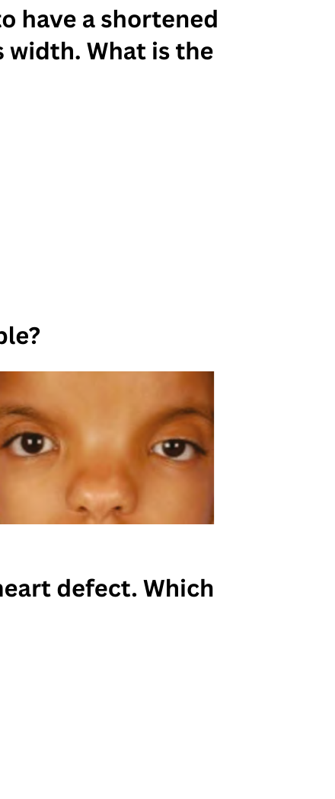

**الشرح:** من L9:
- Micrognathia = فك سفلي صغير
- Macrognathia = فك سفلي كبير
- Retrognathia = فك سفلي متراجع للخلف
- Prognathia = فك سفلي بارز للأمام

---

### Q: What is the term used to describe the vertical groove between the base of the nose and the border of the upper lip?
**الإجابة: A) Philtrum**

**الشرح:** الـ Philtrum هو الخدّ الرأسي بين قاعدة الأنف والشفة العليا. من L9.

---

### Q: Which term describes the presence of an extra digit?
**الإجابة: D) Polydactyly**

**الشرح:** من L9:
- Polydactyly = أصابع زائدة
- Syndactyly = التصاق الأصابع
- Oligodactyly = نقص أصابع
- Arachnodactyly = أصابع طويلة كأرجل العنكبوت (في Marfan)

---

### Q: A child has an increased distance between the eyes. Which term best describes this?
**الإجابة: C) Hypertelorism**

**الشرح:** Hypertelorism = زيادة المسافة بين العينين. Hypotelorism = تقارب العينين.

---

### Q: What best describes short fingers?
**الإجابة: B) Brachydactyly**

**الشرح:** Brachydactyly = قصر الأصابع. Clinodactyly = انحراف أصابع.

---

### Q: What is the term used to describe microstomia?
**الإجابة: B) Small mouth**

**الشرح:** Microstomia = small mouth (فم صغير).

---

### Q: Which of the following is considered as major anomaly?
**الإجابة: B) Anencephaly**

**الشرح:** من L9: Major anomalies = تشوهات بنيوية مهمة تؤثر على الوظيفة (مثل: anencephaly، heart defects، cleft palate). Minor anomalies = تشوهات صغيرة لا تؤثر على الوظيفة (lip pits، epicanthic fold، Brushfield spots).

---

### Q: Which of the following is considered as a major defect?
**الإجابة: A) Microcephaly**

**الشرح:** Microcephaly = major anomaly. Lacrimal duct stenosis، epicanthic fold، Brushfield spots = minor anomalies.

---

### Q: Which of the following disorders develops arachnodactyly of fingers and toes?
**الإجابة: A) Marfan**

**الشرح:** Arachnodactyly (أصابع طويلة رفيعة مثل أرجل العنكبوت) سمة مميزة لـ Marfan syndrome بسبب طفرة في جين FBN1.

---

### Q: What is a major anomaly of Marfan syndrome?
**الإجابة: B) Aortic aneurysm**

**الشرح:** من L9+L14: السمات الرئيسية لـ Marfan: Aortic root dilation/aneurysm (major)، arachnodactyly، ectopia lentis. Pes planus وscoliosis = minor.

---

### Q: What is a major anomaly of Marfan syndrome? (Q57 in Season bank)
**الإجابة: B) Aortic aneurysm**

---

### Q: Identify the syndrome shown in the image? (Marfan features)
**الإجابة: Marfan syndrome**

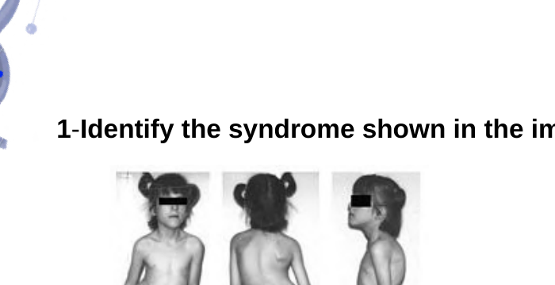

---

### Q: Identify the syndrome shown in the image? (Klinefelter features)
**الإجابة: Klinefelter syndrome**

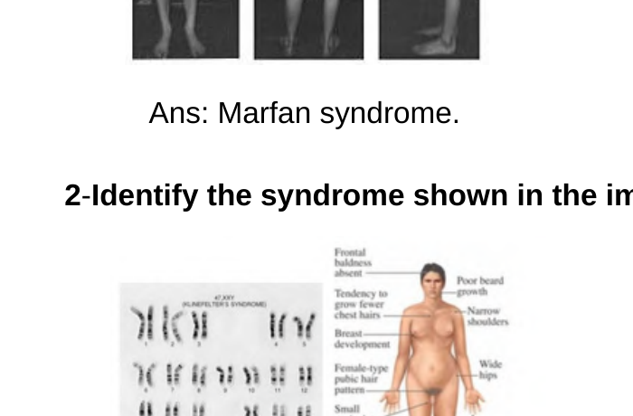

---

### Q: What is the mode of inheritance of the condition shown in the image (X-linked recessive)?
**الإجابة: X-linked recessive**

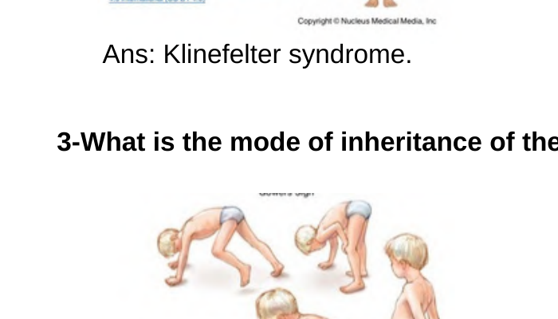

---

### Q: Identify the syndrome (Silver-Russell syndrome features)
**الإجابة: Silver-Russell syndrome**

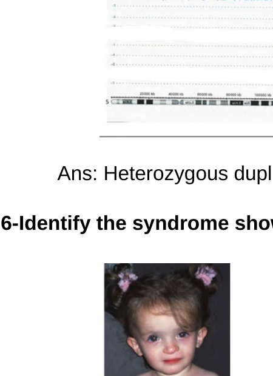

---

### Q: Identify the syndrome (Achondroplasia features)
**الإجابة: Achondroplasia**

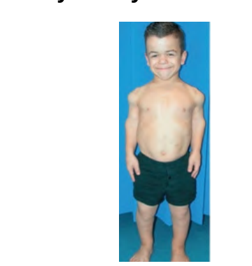

---

### Q: Identify the syndrome (Neurofibromatosis type 1)
**الإجابة: Neurofibromatosis type 1**

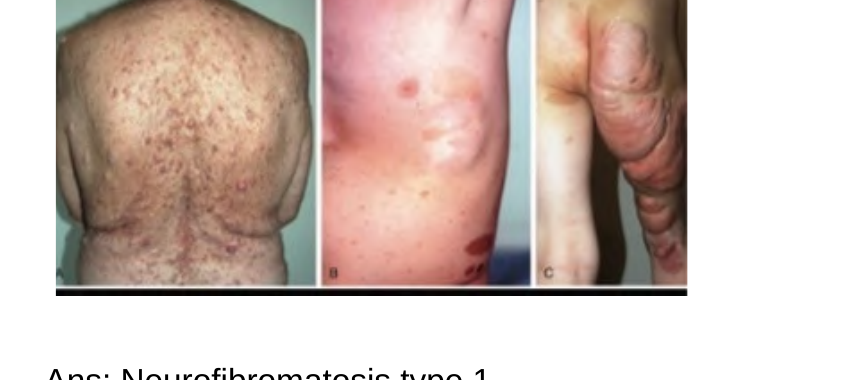

---

### Q: Hurler and Hunter can present similarly, which feature can distinguish between them?
**الإجابة: B) Corneal clouding**

**الشرح:** كلاهما mucopolysaccharidosis. Hurler (MPS I) = corneal clouding موجودة. Hunter (MPS II) = لا يوجد corneal clouding (يُساعد في التمييز).

---

### Q: A patient presents with café-au-lait spots and optic nerve glioma. What gene is responsible?
**الإجابة: B) NF1**

**الشرح:** NF1 (Neurofibromin 1) على كروموسوم 17q. Café-au-lait spots وLisch nodules وoptic glioma من سمات NF1.

---

### Q: A child has NF1 with café-au-lait spots. His mother has NF1 with only mild symptoms. What explains the difference?
**الإجابة: B) Variable expressivity**

---

### Q: A 4-year-old girl has short stature, webbed neck, pulmonary valve stenosis, and downslanting palpebral fissures. Which genetic abnormality?
**الإجابة: A) Gain-of-function mutation in PTPN11**

**الشرح:** هذه أعراض Noonan syndrome. 50% من حالات Noonan ناتجة عن gain-of-function mutation في PTPN11 gene.

---

### Q: Which of the following is associated with Noonan Syndrome?
**الإجابة: A) Bleeding diseases** (coagulation defects)

**الشرح:** Noonan syndrome مرتبط بـ: short stature، pulmonary stenosis، bleeding disorders (factor XI deficiency)، webbed neck، downslanting palpebral fissures.

---

### Q: A couple came with a 12-year-old girl with short stature, enlarged head, and rhizomelic shortening of long bones. How to confirm diagnosis?
**الإجابة: A) DNA analysis for FGFR3**

**الشرح:** هذه أعراض Achondroplasia (قصر القامة بسبب قصر العظام الطرفية). تأكيد التشخيص: DNA analysis لـ FGFR3 (gain-of-function mutation).

---

### Q: A child with Marfan syndrome is started on medication to reduce risk of aortic root dilation. Which class?
**الإجابة: B) Beta blockers**

**الشرح:** Beta blockers (مثل propranolol) يُستخدمون لتقليل الضغط على جدار الأبهر في Marfan syndrome.

---

### Q: A 7-year-old boy with calf pseudohypertrophy and positive Gowers sign. Deletion causing loss of dystrophin. Which therapy?
**الإجابة: B) DMD exon skipping therapy**

**الشرح:** Exon skipping therapy يُستخدم في DMD لاستعادة إطار القراءة (reading frame) وإنتاج dystrophin وظيفي جزئياً.

---

### Q: Interpret the following result — Homozygous mutant
**الإجابة: Homozygous mutant**

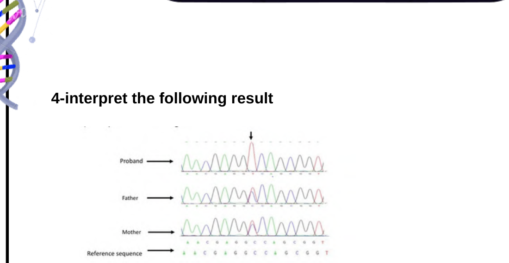

---

### Q: Interpret the following result and identify the affected chromosomal arm — Heterozygous duplication of the p arm
**الإجابة: Heterozygous duplication of the p arm**

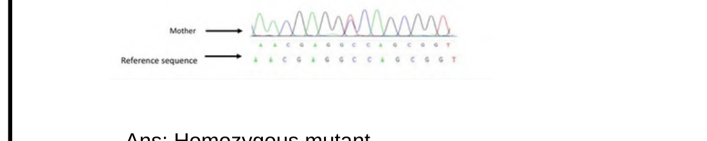

---

---

## 📚 L10 — Birth Defects (عيوب الولادة)

---

### Q: A newborn is diagnosed with an isolated congenital heart defect. Which type of birth defect does this represent?
**الإجابة: C) Malformation**

**الشرح:** من L10:
- **Malformation** = تشوه بنيوي ناتج عن خلل جوهري في تطور العضو نفسه (primary & intrinsic). مثال: congenital heart defect، neural tube defect.
- **Disruption** = تشوه ناتج عن تدمير بنية كانت طبيعية (secondary & extrinsic). مثال: amniotic band syndrome.
- **Deformation** = تشوه ناتج عن قوة ميكانيكية غير طبيعية. مثال: talipes equinovarus.
- **Dysplasia** = تشوه ناتج عن تنظيم غير طبيعي للخلايا في الأنسجة. مثال: ectodermal dysplasia.

---

### Q: Which of the following birth defects is considered a disruption?
**الإجابة: D) Amniotic band syndrome**

**الشرح:** Amniotic band syndrome = الأربطة الأمنيوسية تُدمر بنى كانت طبيعية (secondary & extrinsic process).

---

### Q: Which of the following is caused by abnormal organization of tissue?
**الإجابة: A) Ectodermal dysplasia**

**الشرح:** Dysplasia = تنظيم غير طبيعي للخلايا في النسيج. Ectodermal dysplasia مثال على ذلك.

---

### Q: What is the best description of disruption?
**الإجابة: B) Secondary and extrinsic**

**الشرح:** Disruption = عملية ثانوية وخارجية (secondary & extrinsic) تُدمر بنية كانت طبيعية.

---

### Q: Which of the following terms describes the abnormal mechanical force which distorts an otherwise normal structure?
**الإجابة: C) Deformation**

**الشرح:** Deformation = قوة ميكانيكية غير طبيعية تُشوّه بنية طبيعية. مثال: ضغط الرحم على القدم → talipes.

---

### Q: Primary and intrinsic…
**الإجابة: A) Malformation**

**الشرح:** Malformation = أولية وجوهرية (primary & intrinsic) = خلل في برنامج التطور نفسه.

---

### Q: Certain malformations tend to occur together more frequently than expected by chance. Which best represents this concept?
**الإجابة: B) VACTERL association**

**الشرح:** Association = تشوهات تظهر معاً بتكرار أكثر من المتوقع بالصدفة دون سبب جيني واحد محدد. VACTERL (Vertebral, Anal, Cardiac, Tracheo-Esophageal, Renal, Limb defects).

---

### Q: A newborn presents with vertebral anomalies, anal atresia, tracheoesophageal fistula, and renal abnormalities. Most likely diagnosis?
**الإجابة: C) VATER association**

**الشرح:** VATER/VACTERL = Vertebral + Anal atresia + Cardiac + Tracheoesophageal fistula + Esophageal atresia + Renal + Limb defects.

---

### Q: A male newborn with vertebral anomalies, anal atresia, tracheoesophageal fistula, and radial ray defects. Normal WES and microarray. Most likely diagnosis?
**الإجابة: B) VATER association**

**الشرح:** VATER/VACTERL هو تشخيص إكليني، ليس لديه سبب جيني جزيئي محدد في معظم الحالات، لذلك الـ WES والـ microarray طبيعيان.

---

### Q: Elevated amniotic AFP has been detected prenatally. To reduce the risk of developing the consequence shown (neural tube defect), what could be given?
**الإجابة: B) Folic acid**

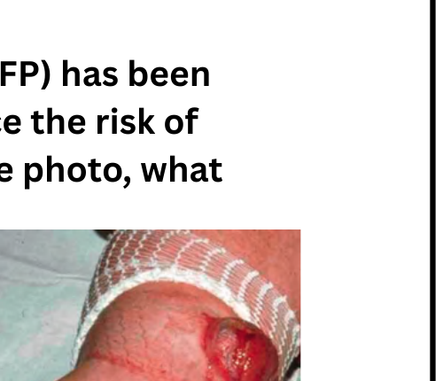

**الشرح:** من L10: حمض الفوليك يُقلل خطر النيورال توب ديفيكت بشكل كبير (Periconceptional folic acid supplementation). AFP مرتفع في الحول الأمنيوسي يدل على NTD مفتوح.

---

### Q: What's correct regarding neural tube defect?
**الإجابة: B) Its risk can be reduced by the intake of Periconceptional folic acid**

**الشرح:** من L10: Folic acid يُقلل خطر NTD. ملاحظة: Anencephaly ينتج من خلل في الجزء العلوي (ليس السفلي) من الأنبوب العصبي.

---

### Q: A couple came to the genetics clinic with a child having bilateral lip/palate. What is the chance of a second child with the same condition?
**الإجابة: D) 4%** (approximately)

**الشرح:** Cleft lip/palate هو multifactorial. الخطر العام في السكان ≈ 1/1000. إذا كان أحد الأبناء مصاباً، فالخطر للأبناء القادمين ≈ 4-5%. إذا كان اثنان مصابَين → يرتفع لـ 10%.

---

### Q: Which of the following has the highest recurrence risk?
**الإجابة: D) Two siblings (with cleft lip/palate)**

**الشرح:** كلما زاد عدد الأفراد المصابين في العائلة، ارتفع خطر التكرار (Empiric recurrence risk في الأمراض متعددة العوامل).

---

### Q: A 3-year-old boy with protruded tongue, simian creases, microcephaly. Susceptible syndrome?
**الإجابة: A) Down syndrome**

**الشرح:** لسان بارز + simian crease + microcephaly = Down syndrome (Trisomy 21).

---

### Q: What is the best test for diagnosing Down syndrome?
**الإجابة: A) Cytogenetic test (Karyotyping)**

---

### Q: Failure to thrive and malnutrition as a result of chronic diarrhea and malabsorption due to pancreatic insufficiency, are clinical features of:
**الإجابة: A) CFTR (Cystic fibrosis)**

**الشرح:** Cystic fibrosis يُسبب قصور البنكرياس → سوء الامتصاص → تأخر النمو. بسبب طفرة في جين CFTR (Chloride channel).

---

### Q: The family came with their 7-year-old girl and 5-year-old boy, complaining of chronic pulmonary disease, failure to thrive, and chronic diarrhea due to pancreatic insufficiency:
- Mode of inheritance: **A) AR (Autosomal Recessive)**
- Clinical test results: **A) High sweat chloride**
- Gene responsible: **A) Chloride channels (CFTR)**
- Other clinical feature: **B) Male infertility due to congenital bilateral absence of the vas deferens (CBAVD)**

---

### Q: A newborn presents with macroglossia, abdominal wall defect, and overgrowth features. Which genetic test is most appropriate?
**الإجابة: Methylation analysis**

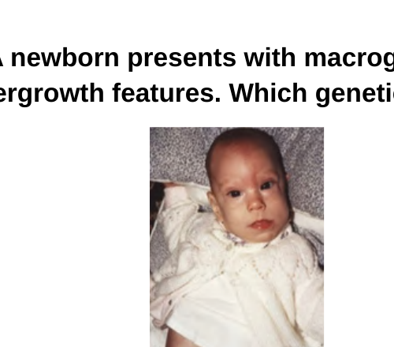

**الشرح:** هذه أعراض Beckwith-Wiedemann syndrome (BWS). يُعالَج عبر methylation analysis لمنطقة 11p15.5 (imprinting disorder).

---

### Q: A neonate presents with macrosomia, macroglossia, umbilical hernia, and neonatal hypoglycemia. Which molecular mechanism?
**الإجابة: D) Abnormal imprinting at chromosome 11p15.5**

**الشرح:** Beckwith-Wiedemann syndrome = خلل في الـ imprinting بمنطقة 11p15.5.

---

### Q: A 14-year-old boy with hypotonia and upslanting palpebral fissures is diagnosed with Down syndrome. What is the most likely underlying mechanism?
**الإجابة: D) Maternal nondisjunction causing trisomy**

**الشرح:** 95% من حالات Down syndrome ناتجة عن nondisjunction (عادةً أمومية) أثناء Meiosis I.

---

### Q: Risk of having this individual's Down syndrome child? (when parent has rob 14;21)
**الإجابة: C) 1-3% (for fathers) or 10-15% (for mothers)**

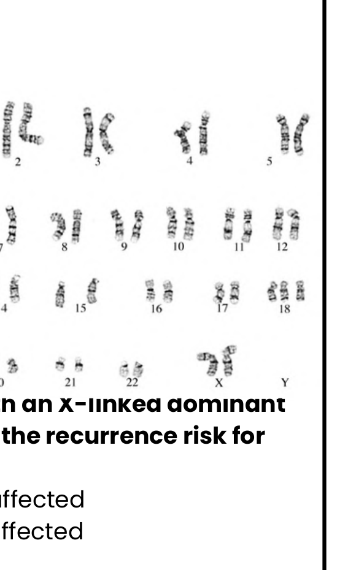

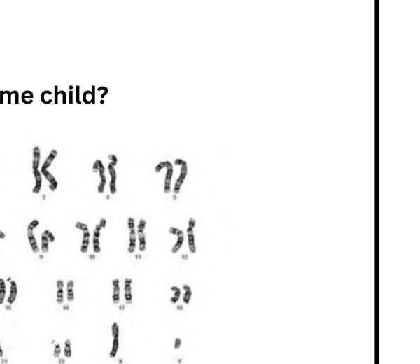

---

---

## 📚 L11 — DNA Repair Mechanisms (آليات إصلاح الحمض النووي)

---

### Q: Which DNA repair mechanism involves the enzyme DNA glycosylase?
**الإجابة: C) Base excision repair (BER)**

**الشرح:** من L11: "Base excision repair (BER) corrects those forms of oxidative, deamination, alkylation and abasic single base damage." DNA glycosylase هو الإنزيم الأول في مسار BER يُزيل القاعدة التالفة.

---

### Q: Which of the following is used in base excision repair mechanism?
**الإجابة: D) DNA glycosylase**

---

### Q: Which disorder is commonly associated with mismatch repair defects due to incorrect base pairing during DNA replication?
**الإجابة: C) Colorectal cancer (non-polyposis)**

**الشرح:** من L11: "Mismatch repair (MMR) is a post replicative repair pathway." خلل في MMR يُسبب Lynch syndrome (hereditary non-polyposis colorectal cancer). HNPCC مرتبط بـ MLH1, MSH2, MSH6, PMS2 genes.

---

### Q: Defect in Mismatch repair will lead:
**الإجابة: B) Non-polyposis colorectal cancer**

---

### Q: A 47-year-old female with tumor in right colon. Father died from colon cancer, paternal aunt had endometrial cancer. Best technique to confirm?
**الإجابة: A) Gene panel** (for Lynch syndrome genes: MLH1, MSH2, etc.)

**الشرح:** هذا النمط العائلي يوحي بـ Lynch syndrome (MMR defect). Gene panel لجينات MMR هو الأنسب.

---

### Q: UV light causes:
**الإجابة: A) Pyrimidine dimers**

**الشرح:** من L11: الأشعة فوق البنفسجية (UV) تُسبب تكوين Thymine dimers (pyrimidine dimers) بين قواعد متجاورة على نفس السلسلة، وتُصلح بواسطة NER.

---

### Q: Responsible for correction of thymidine dimer:
**الإجابة: B) NER (Nucleotide Excision Repair)**

**الشرح:** من L11: "Nucleotide excision repair (NER) is the pathway of choice to remove bulky lesions such as thymine dimers and lesions from UV radiation."

---

### Q: Xeroderma Pigmentosum — defect in:
**الإجابة: Defect in nucleotide excision repair (NER)**

**الشرح:** من L11: "Xeroderma Pigmentosum: Defect in nucleotide excision repair. Extreme sensitivity to UV light & a high frequency of skin cancer."

---

### Q: Which of the following DNA repair mechanisms can cause mistakes?
**الإجابة: B) Non-homologous end joining (NHEJ)**

**الشرح:** من L11: NHEJ هو آلية إصلاح كسور الخيط المزدوج وهي error-prone (تُسبب أخطاء) لأنها لا تستخدم قالباً.

---

### Q: Which of the following is used in base excision repair (in context of one enzyme)?
**الإجابة: A) DNA glycosylase**

---

### Q: What of the following DNA repair mechanisms is a Direct reversal mechanism?
**الإجابة: D) Photoreactivation**

**الشرح:** من L11: Direct reversal mechanisms:
- Photoreactivation (في البكتيريا) تُصلح pyrimidine dimers مباشرة
- O6-methylguanine-DNA methyltransferase = إزالة مجموعة المثيل مباشرة

---

### Q: An alteration in DNA polymerase lacks exonuclease 5'-3' which results in:
**الإجابة: C) Decrease in RNA primer removal**

**الشرح:** الـ 5'→3' exonuclease activity لـ DNA polymerase مسؤولة عن إزالة primers RNA أثناء التضاعف. فقدانها يُقلل إزالة الـ primers.

---

### Q: Ahlam is a 47-year-old teacher who has breast cancer, it was found that she has a mutation in the BRCA2 gene. Which is most likely defected?
**الإجابة: Homologous recombination repair**

**الشرح:** BRCA1 وBRCA2 يلعبان دوراً أساسياً في إصلاح كسور الخيط المزدوج عبر Homologous Recombination. خللهما يُسبب ميلاً للإصابة بسرطان الثدي والمبيض.

---

### Q: Mutations in BRCA2 gene:
**الإجابة: D) Males have an increased risk to develop a prostate cancer**

**الشرح:** BRCA2 mutation: يرفع خطر سرطان الثدي في الإناث، وأيضاً خطر سرطان البروستات في الذكور. ليس 3-5% من كل سرطانات الثدي بل من الحالات العائلية.

---

### Q: Sara is a 30-year-old female with a family history of breast cancer. Her mother had breast cancer caused by BRCA1. Appropriate test for Sara?
**الإجابة: C) Sanger sequencing**

**الشرح:** لأن الطفرة معروفة في الأم (BRCA1 specific mutation)، الأنسب هو Sanger sequencing لفحص هذا الموضع المحدد لدى Sara.

---

### Q: A family with two affected boys: muscle weakness, positive Gowers sign. Maternal uncle wheelchair-dependent with dilated cardiomyopathy:
- Additional manifestation: **B) Calf pseudohypertrophy**
- Expected lab results: **A) High creatine kinase level**
- Gene responsible: **A) Dystrophin encoding gene (DMD)**
- Genetic abnormality: **A) Gene deletion** (most common in DMD)

---

### Q: Which type of mutation is controversial to genetic therapy?
**الإجابة: B) Germline Mutation**

**الشرح:** العلاج الجيني للطفرات الجنينية (germline) مثير للجدل أخلاقياً لأنه يُؤثر على كل الأجيال القادمة.

---

---

## 📚 L12 — Gene Variants / Mutations (المتغيرات الجينية)

---

### Q: Which of the following best describes a nonsense mutation?
**الإجابة: B) A substitution creating a premature stop codon**

**الشرح:** من L12: "Nonsense (Stopgain) Variant: A substitution that leads to the generation of one of the stop codons (UAA, UAG, or UGA) → Will result in a premature termination of translation (truncated protein)."

---

### Q: Which of the following variants is an example of a missense mutation?
**الإجابة: C) p.Arg117His**

**الشرح:** من L12: Missense = استبدال حمض أميني بآخر. p.Arg117His = Arginine استبدلت بـ Histidine في موضع 117.
- p.Gly542* = Nonsense (علامة * تعني stop codon)
- c.489+1G>T = Splice site mutation
- p.Phe508del = Frameshift/deletion (CF الطفرة الشائعة)

---

### Q: Which of the following variants is an example of a nonsense mutation?
**الإجابة: B) p.Gly542***

**الشرح:** العلامة * في nomenclature الجينية تعني stop codon → nonsense mutation.

---

### Q: Which of the following disorders is most commonly caused by loss of function of the protein product?
**الإجابة: D) Familial hypercholesterolemia**

**الشرح:** من L12: "Loss-of-function variants → haploinsufficiency → familial hypercholesterolemia" (نقص مستقبل LDL). أما Huntington وAchondroplasia = gain-of-function، Marfan = dominant-negative.

---

### Q: When a mutant gene product interferes with the function of the normal protein in a heterozygous state, this is known as:
**الإجابة: C) Dominant-negative effect**

**الشرح:** من L12: "Dominant-Negative Variants: When a mutant gene in the heterozygous state interferes with the function of the normal gene product → results in loss of protein activity or function. E.g., osteogenesis imperfecta and Marfan syndrome."

---

### Q: Which codons function as stop codons and terminate translation?
**الإجابة: D) UGA, UAA, and UAG**

**الشرح:** من L12: كودونات الإيقاف (stop codons): UAA، UAG، UGA. أما AUG = start codon (methionine).

---

### Q: Which sequence correctly describes the major DNA repair mechanism?
**الإجابة: A) Cleavage → Removal → Insertion → Sealing**

**الشرح:** من L11: آلية الإصلاح العامة:
1. Cleavage (بواسطة endonuclease)
2. Removal (بواسطة exonuclease)
3. Insertion (بواسطة DNA polymerase)
4. Sealing (بواسطة ligase)

---

### Q: What is a compound heterozygous mutation?
**الإجابة: A) When a child inherits an autosomal recessive disorder from both parents, who have different mutations on the same gene**

**الشرح:** من L12: "Compound Heterozygous (CH) variant occurs when a person inherits two heterozygous alleles, one from each parent, and these alleles are located at different positions within the same gene."

---

### Q: Sickle cell anemia is an example of what type of mutation?
**الإجابة: B) Missense**

**الشرح:** Sickle cell anemia ناتج عن استبدال Glutamic acid بـ Valine في موضع 6 من سلسلة beta-globin (GAG → GTG على مستوى DNA) = missense mutation.

---

### Q: What could be the effect of a coding sequence of 114 nucleotides including start and stop codons that has an insertion of 9 nucleotides at position 82?
**الإجابة: A) Insertion of 3 amino acids**

**الشرح:** إدراج 9 نيوكليوتيدات = 9/3 = 3 كودونات = 3 أحماض أمينية إضافية. لأن 9 مضاعف للثلاثة، لا يحدث frameshift → يُضاف 3 أحماض أمينية فقط.

---

### Q: Explain mRNA splicing mutations:
**الشرح من L12:** Splice variants هي طفرات في مواقع intron-exon boundaries تُغير إشارات الـ splicing:
- تُسبب exon skipping (حذف exon)
- أو intron retention (احتجاز intron)
- مما يؤدي إلى frameshift أو بروتين معيب
- يحدث في splice donor site (GT) أو splice acceptor site (AG)

---

### Q: Marfan syndrome and gene affected:
**الشرح:** Marfan syndrome = طفرة في جين **FBN1** (Fibrillin-1) على كروموسوم 15q. يؤدي إلى Dominant-negative effect → بروتين fibrillin-1 معيب يُعطل الـ microfibrils الطبيعية.

---

### Q: A patient presented with long stature and arms, aortic root dilation, scoliosis, and pes planus (flat feet). What is the affected gene?
**الإجابة: B) FBN1**

---

### Q: Which factor most strongly influences recurrence risk in multifactorial disorders?
**الإجابة: C) Degree of relationship to the index case**

**الشرح:** في الأمراض متعددة العوامل (multifactorial)، كلما كانت القرابة أقرب كلما ارتفع الخطر. الخطر يتناقص بشكل كبير من درجة أولى → ثانية → ثالثة.

---

### Q: Between adenine and guanine transformation?
**الإجابة: A) Transition (mutation)**

**الشرح:** Transition = استبدال purine بـ purine أو pyrimidine بـ pyrimidine (A↔G أو C↔T). Transversion = استبدال purine بـ pyrimidine أو العكس.

---

### Q: 18. Which of the following is the result of three alpha globin alleles?
**الإجابة: A) HbH disease**

**الشرح:** 
- 4 alpha globin alleles طبيعية: طبيعي
- 3 alleles: HbH disease (مرض الـ HbH)
- 2 alleles: alpha-thal trait (صفة)
- 1 allele: Hydrops fetalis (هيدروبس جنيني، مميت)
- 0 alleles: لا ينجو (Hb Barts)

---

### Q: Mutations in 4 alpha globin alleles is associated with?
**الإجابة: B) Hydrops fetalis**

---

### Q: Which of the following disorders is due to a structural change in the globin chain?
**الإجابة: A) Sickle cell anemia**

**الشرح:** Sickle cell = تغيير هيكلي في بروتين beta-globin (missense). أما HbH وdelta-beta thalassemia = نقص في إنتاج الـ globin chains وليس تغيير هيكلي.

---

---

## 📚 L13 — Molecular Techniques (التقنيات الجزيئية)

---

### Q: What method can be used to detect DMD?
**الإجابة: A) MLPA (Multiplex Ligation-Dependent Probe Amplification)**

**الشرح:** من L13: "Example of disease which can be diagnosed with MLPA: Duchenne Muscular Dystrophy (DMD)." MLPA يكتشف الـ deletions والـ duplications على مستوى الـ exons.

---

### Q: Which is NOT required for a PCR reaction?
**الإجابة: B) Dideoxy-dNTPs (ddNTPs)**

**الشرح:** من L13: مكونات PCR: Template DNA + Primers + dNTPs + Thermostable DNA polymerase (Taq) + Buffer. أما ddNTPs (dideoxy) فتُستخدم في Sanger Sequencing وليس PCR العادي.

---

### Q: The polymerase chain reaction for amplification of DNA sequences relies upon the use of:
**الإجابة: B) Heat-stable DNA polymerase (Taq polymerase)**

**الشرح:** من L13: PCR يستخدم Taq polymerase (مستخلصة من Thermus aquaticus) لأنها تتحمل درجات الحرارة العالية في كل دورة من دورات PCR.

---

### Q: Which of the following methods is used for separation of DNA fragments?
**الإجابة: C) Gel electrophoresis**

**الشرح:** Gel electrophoresis يفصل شظايا DNA حسب الحجم. PCR = تضخيم، Restriction digestion = قطع، Bacterial transformation = إدخال DNA للبكتيريا.

---

### Q: What is the correct sequence of events in Southern blotting?
**الإجابة: C) Separation of DNA fragments by electrophoresis → transfer to a membrane → hybridization with a labelled probe sequence**

**الشرح:** Southern blot خطوات:
1. قطع DNA بـ restriction enzymes
2. فصل الشظايا بـ gel electrophoresis
3. نقل (transfer) للـ membrane (نيتروسيليلوز)
4. Hybridization مع probe مُعلَّم (labeled)
5. كشف الإشارة

---

### Q: What is the natural function of restriction enzymes?
**الإجابة: D) Protecting bacteria by cleaving the DNA of infecting viruses**

**الشرح:** Restriction enzymes في البكتيريا تقطع DNA الغريب (الفيروسات) لحماية البكتيريا. أما DNA البكتيريا نفسها فيكون محمياً بالـ methylation.

---

### Q: Some bacteria have developed antibiotic resistance. What feature gives them this property?
**الإجابة: B) They contain a plasmid with genes for antibiotic resistance**

**الشرح:** الـ Plasmid هو DNA دائري صغير خارج الكروموسوم الرئيسي، يمكنه حمل جينات مقاومة المضادات الحيوية ونقلها بين البكتيريا.

---

### Q: What is the best genetic testing for chromosomal duplication < 3 mega base pair?
**الإجابة: A) Microarray**

**الشرح:** من L13: "CMA (Chromosomal Microarray) detects microdeletions/microduplications < 5Mb with resolution ~1Kb." الـ Conventional karyotyping لا يكتشف < 5-10Mb.

---

### Q: An 18-month-old with muscle weakness and frequent falls. Doctor suspects a point mutation on the SMN1 gene. How to confirm?
**الإجابة: C) Sanger Sequencing**

**الشرح:** من L13: Sanger sequencing يُستخدم للكشف عن point mutations في جين محدد. MLPA يكتشف deletions/duplications لا point mutations. (ملاحظة: SMN1 deletions تُكتشف بـ MLPA، لكن point mutations تحتاج Sanger)

---

### Q: A 2-year-old child has developmental delay and multiple congenital anomalies. Chromosome analysis and microarray are negative, no specific syndrome suspected. Most appropriate next test?
**الإجابة: D) Whole exome sequencing (WES)**

**الشرح:** من L13: WES يُستخدم عندما تفشل الفحوصات الأخرى. يكشف عن SNVs وsmall indels في جميع exons. يُستخدم بشكل خاص في DD/ID غير محدد السبب.

---

### Q: A woman with breast cancer is found to carry a pathogenic CHEK2 variant. Which test is most appropriate to screen her siblings?
**الإجابة: D) Sanger sequencing**

**الشرح:** لأن الطفرة محددة (specific known variant في CHEK2)، نستخدم Sanger sequencing لفحص هذا الموضع بالذات عند الإخوة.

---

### Q: Chromosome analysis would be most helpful in diagnosing which of the following disorders?
**الإجابة: C) Klinefelter syndrome**

**الشرح:** من L13: Chromosome analysis (Karyotyping) يكشف التغيرات العددية والبنيوية الكبيرة كـ 47,XXY. أما NF1، CF، DMD = أمراض جين وحيد تحتاج molecular testing.

---

### Q: Chromosome analysis can be used for which of the following?
**الإجابة: A) Klinefelter syndrome**

---

### Q: The following Sanger Sequencing has been done for healthy parents and an affected son. What is the mode of transmission?
**الإجابة: C) Autosomal recessive**

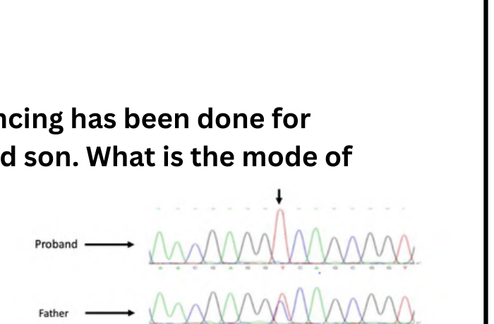

---

### Q: A blood sample from a crime scene. DNA analysis of victim and two suspects done. Which one is the criminal?
**الإجابة: D) Suspect 2**

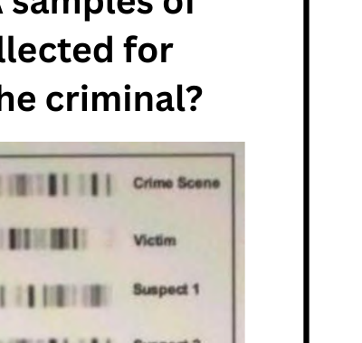

---

### Q: The following figure shows RFLP data done for a family of sickle cell disease:
**الإجابة: A) Both parents are carriers and child C3 is normal**

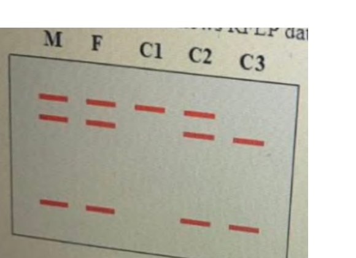

---

### Q: The blot shows RFLP mapping for a case of paternity testing:
**الإجابة: A) Paternity exclusion**

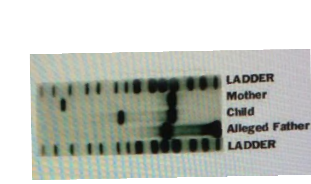

---

### Q: What is the best test for diagnosing chromosomal microduplication (< 3Mb)?
**الإجابة: A) Microarray**

---

### Q: PCR amplifying DNA by using _______ isolated from living bacteria:
**الإجابة: A) DNA polymerase (Taq polymerase)**

**الشرح:** Taq polymerase مستخلصة من بكتيريا Thermus aquaticus التي تعيش في ينابيع ساخنة.

---

### Q: Cloning is the process of:
**الإجابة: B) Selective amplification of a specific DNA sequence**

**الشرح:** ملاحظة: هذا السؤال فيه التباس. الـ Cloning قد يُقصد به PCR amplification أو gene cloning (إدخال جين في vector وتضخيمه في bacteria). الإجابة B تُشير إلى PCR.

---

### Q: What method can be used to detect anemia carrier?
**الإجابة: B) Electrophoresis**

**الشرح:** Hemoglobin electrophoresis يُميز بين HbA وHbS وHbC وHbF → يكشف ناقلي الأنيميا المنجلية والثلاسيميا.

---

### Q: What is the 2nd trimester test advised for a mother with one child with galactosemia?
**الإجابة: A) Newborn screening of galactosemia** (after birth) / أو **B) Parent carrier test**

**الشرح من L14:** في الحمل الجديد، الأنسب هو فحص الوالدَين كناقلَين أو prenatal diagnosis. Newborn screening يُطبَّق بعد الولادة.

---

## 📚 L14 — Approach to Patients & Families with Genetic Conditions

---

### Q: What are the Potential Reasons for Pediatric Genetic Counseling?
**الإجابة: D) Child with a family history of a genetic condition**

**الشرح:** Pediatric genetic counseling يُشمل: أطفال بتشوهات، تأخر نمو، أطفال ذوي تاريخ عائلي لحالات جينية. Adult onset يُعالَج بـ adult genetic counseling.

---

### Q: According to genetic counseling, all the following is true EXCEPT:
**الإجابة: A) Genetic counseling is directive**

**الشرح:** من L14: Genetic counseling هو Non-directive (لا يُعطي توجيهات مباشرة). يُقدم المعلومات ليتخذ الفرد قراره بنفسه.

---

### Q: Two parents came to counseling. They have 2 affected children with Hemophilia A. They want a healthy child. What to recommend?
**الإجابة: A) Preimplantation genetic diagnosis (PGD)**

**الشرح:** PGD = فحص الجنين قبل الزرع في أثناء IVF لاختيار الأجنة غير المصابة.

---

### Q: A 30-year-old male with chronic pulmonary disease and infertility. Possible diagnosis?
**الإجابة: B) Cystic fibrosis**

**الشرح:** CF في الذكور يُسبب: مرض رئوي مزمن + عقم ذكوري بسبب CBAVD (congenital bilateral absence of vas deferens).

---

### Q: Medication given in first trimester of pregnancy?
**الإجابة: B) Folic acid**

**الشرح:** حمض الفوليك يُعطى في الأشهر الأولى (periconceptional) لتقليل خطر NTD. Streptomycin وIsoniazid خطرة في الحمل.

---

### Q: A male with TB disease using isoniazid and having severe adverse effects:
**الإجابة: C) Change the drug**

**الشرح:** Isoniazid metabolism يختلف حسب NAT2 phenotype (slow vs fast acetylators). في Slow acetylators قد تحدث سمية عصبية. السبب pharmacogenetics.

---

### Q: An increase in inhibin-A level in maternal serum is a diagnosis of?
**الإجابة: B) Down syndrome pregnancies**

**الشرح:** Maternal serum screening: في Down syndrome ترتفع: inhibin-A وhCG. تنخفض: AFP وEstriol.

---

### Q: Which of the following prenatal tests doesn't carry a risk of fetal loss?
**الإجابة: A) Maternal serum AFP**

**الشرح:** Maternal serum AFP هو فحص دم بسيط للأم ولا يحمل أي خطر على الجنين. أما CVS وAmniocentesis وFetal tissue sampling فكلها تحمل خطر إجهاض.

---

### Q: Sara is a 30-year-old female who came to genetic counseling with a history of breast cancer in family. Her mother had breast cancer caused by BRCA1. Appropriate test for Sara?
**الإجابة: C) Sanger sequencing**

---

### Q: What is the major congenital anomaly in Prader-Willi syndrome?
**الإجابة: A) Hypogonadism**

**الشرح:** Hypogonadism هو major anomaly في PWS (يؤثر على الوظيفة التناسلية). الأمثلة الأخرى: almond-shaped eyes = minor anomaly.

---

### Q: 6-year-old boy with hypogonadism, obesity, almond-shaped eyes. Diagnosis?
**الإجابة: D) Prader-Willi**

---

### Q: A 2-year-old child presented with muscle weakness and frequent falls. The doctor suspects a point mutation on the SMN1 gene. How to confirm this?
**الإجابة: C) Sanger Sequencing** (لـ point mutations)

**ملاحظة:** لو كان المشتبه به deletion (وهو الأكثر شيوعاً في SMA) يُستخدم MLPA. السؤال يذكر "point mutation" تحديداً فلذلك Sanger هو الأنسب.

---

### Q: SHORT ESSAY — Explain mRNA splicing mutations:
**الإجابة الكاملة:**
- Splice variants تحدث عند intron-exon boundaries
- تُغير splice donor site (GT) أو splice acceptor site (AG)
- النتيجة: Exon skipping أو intron retention
- يمكن أن تؤدي إلى frameshift وبروتين مقتطع (truncated)
- مثال: طفرة c.489+1G>T في CFTR

---

### Q: What is the diagnosis and gene affected (NF1 case — cafe au lait spots, optic glioma)?
**الإجابة:**
- Diagnosis: Neurofibromatosis type 1 (NF1)
- Gene: NF1 (Neurofibromin) on chromosome 17q11.2

---

---

## 📚 أسئلة إضافية متنوعة — الميد الثاني

---

### Q: Which of the following is associated with Noonan Syndrome?
**الإجابة: A) Bleeding diseases**

---

### Q: Cri-du-chat Syndrome is caused by:
**الإجابة: B) Deletion in 5p**

**الشرح:** Cri du chat = حذف الذراع القصير لكروموسوم 5 (5p-). المميزات: صرخة شبيهة بصوت القطة، microcephaly، ID.

---

### Q: Which of the following vitamins could be used to treat homocysteinuria?
**الإجابة: B) Vit B6 (Pyridoxine)**

**الشرح:** Homocystinuria (خلل في CBS enzyme) يُعالَج بـ Vitamin B6 (pyridoxine) في الحالات المستجيبة، إضافة لنظام غذائي منخفض methionine.

---

### Q: Which of the following is caused by abnormal organization of tissue?
**الإجابة: A) Ectodermal dysplasia**

---

### Q: What is the main O2 transport protein in humans during the last 7 months of pregnancy in the uterus?
**الإجابة: B) HbF (Fetal Hemoglobin)**

**الشرح:** HbF يُنتج خلال الحياة الجنينية ولديه ألفة أعلى للأكسجين مقارنةً بـ HbA. يُستبدل بـ HbA بعد الولادة.

---

### Q: A 3-week-old baby came to emergency room with vomiting, diarrhea, organomegaly, and loss of consciousness. What is the diagnostic method?
**الإجابة: D) Galactose-1-phosphate**

**الشرح:** هذه أعراض Galactosemia (خلل استقلاب الجالاكتوز). التشخيص: قياس مستوى galactose-1-phosphate في كريات الدم الحمراء.

---

### Q: Which of the following is an X-linked disorder?
**الإجابة: A) OTC deficiency (Ornithine Transcarbamylase)**

**الشرح:** OTC deficiency = X-linked recessive (أكثر شيوعاً في الذكور). PKU وGlycogen storage disorder = Autosomal recessive.

---

### Q: What is the main O2 transport protein during the last 7 months of pregnancy?
**الإجابة: B) HbF**

---

### Q: Chromosome analysis can be used for which of the following?
**الإجابة: A) Klinefelter syndrome**

---

### Q: Which of the following is the result of three alpha globin alleles deleted?
**الإجابة: A) HbH disease**

---

### Q: Risk of having this individual's Down syndrome child (when both parents carry rob 21;21):
**الإجابة: 100%**

---

### Q: A female presented in NICU — heart, renal, microcephaly, microphthalmia, hypertelorism, postaxial polydactyly. Provisional diagnosis?
**الإجابة: A) Patau syndrome (Trisomy 13)**

---

### Q: A child is found to have anemia carrier — how to detect?
**الإجابة: B) Electrophoresis (Hemoglobin electrophoresis)**

---

### Q: An 18-month-old with muscle weakness — point mutation in SMN1 — how to confirm?
**الإجابة: C) Sanger Sequencing**

---

### Q: What is the enzyme used to convert RNA to DNA?
**الإجابة: C) Reverse transcriptase**

**الشرح:** Reverse transcriptase هو إنزيم يُحوّل RNA إلى DNA (cDNA). يُستخدم في RT-PCR وكذلك يستخدمه فيروس HIV.

---

### Q: PCR amplifying DNA by using ______ isolated from living bacteria:
**الإجابة: A) DNA polymerase (Taq polymerase)**

---

### Q: Which of the following is considered as a major congenital anomaly in Prader-Willi syndrome?
**الإجابة: A) Hypogonadism**

---

### Q: What of the following DNA repair mechanisms is a Direct reversal mechanism?
**الإجابة: D) Photoreactivation**

---

### Q: Mutations in 4 alpha globin alleles is associated with?
**الإجابة: B) Hydrops fetalis**

---

### Q: A 30-year-old male had chronic pulmonary disease and infertility. Possible diagnosis?
**الإجابة: B) Cystic fibrosis**

---

### Q: Which of the following prenatal tests doesn't carry a risk of fetal loss?
**الإجابة: A) Maternal serum AFP**

---

### Q: Two parents have 2 affected children with Hemophilia A. They want a healthy child. Recommendation?
**الإجابة: A) Preimplantation genetic diagnosis (PGD)**

---

### Q: 6-year-old boy with hypogonadism, obesity, almond-shaped eyes. Diagnosis?
**الإجابة: D) Prader-Willi**

---

### Q: The enzyme used to convert RNA to DNA:
**الإجابة: C) Reverse transcriptase**

---

### Q: Medication given in first trimester of pregnancy:
**الإجابة: B) Folic acid**

---

### Q: An increase in inhibin-A level in maternal serum is a diagnosis of:
**الإجابة: B) Down syndrome pregnancies**

---

### Q: According to genetic counseling, all the following is true EXCEPT:
**الإجابة: A) Genetic counseling is directive**

---

### Q: 47,XXY is a numerical chromosomal abnormality. (True/False)
**الإجابة: True** — Klinefelter syndrome = trisomy of sex chromosomes.

---

### Q: A karyotype showing 46,XX,der(14;21)+21 is considered a Robertsonian translocation. (True/False)
**الإجابة: True**

---

### Q: What is the diagnosis (karyotype 47,XY,+13)?
**الإجابة: Trisomy 13 — Patau's syndrome**

---

### Q: What is the karyotype shown (Turner)? 45,X
**الإجابة: Turner's syndrome — 45,X**

---

### Q: What does the following karyotype show (69 chromosomes)?
**الإجابة: B) Aneuploidy / Triploidy**

---

### Q: Short essay — Marfan Syndrome and gene affected:
**الإجابة:**
- Gene: **FBN1** (Fibrillin-1) على كروموسوم 15q21
- Inheritance: Autosomal Dominant
- Mechanism: Dominant-negative effect
- Features: Aortic aneurysm، arachnodactyly، ectopia lentis، tall stature، scoliosis
- Treatment: Beta-blockers لحماية الأبهر

---

### Q: Short essay questions (Jackaroo 2 - page 65):
**1) Explain mRNA splicing mutations:**
طفرات في مواقع splice donor (GT) أو splice acceptor (AG) تُسبب exon skipping أو intron retention، مما يؤدي إلى frameshifts أو بروتين معيب.

**2) Marfan Syndrome and gene affected:**
FBN1 gene → Autosomal Dominant → Dominant-negative mechanism

**3) What is the diagnosis and gene affected?**

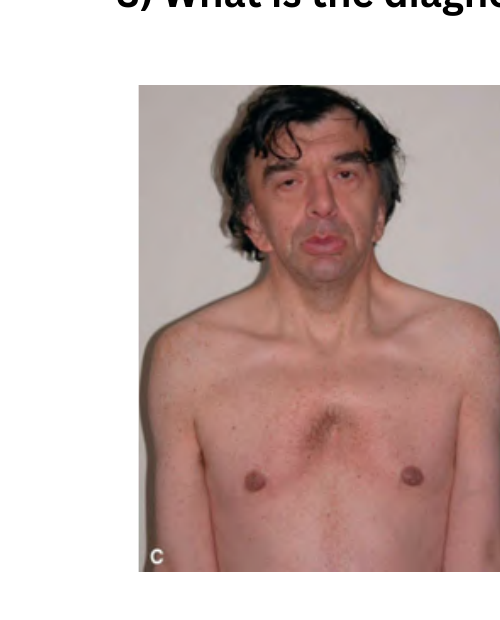

**الإجابة: Marfan syndrome — FBN1 gene (15q21)**

**4) What is the diagnosis and give two clinical features?**

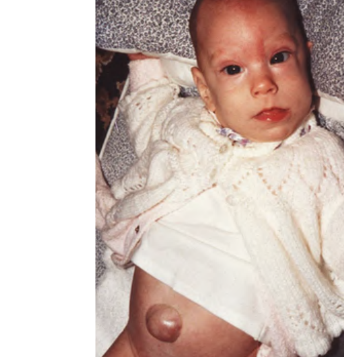

**الإجابة: Beckwith-Wiedemann syndrome — Features: macroglossia، umbilical hernia**

---

## ⚠️ ملاحظات هامة

### أسئلة تحتاج صور (Image-dependent Questions):
الأسئلة التالية تعتمد على صور pedigrees أو karyograms أو نتائج مختبرية غير موجودة في النص:
- صور pedigrees لتحديد نمط الوراثة
- صور karyograms لتحديد التشخيص
- نتائج Sanger sequencing
- نتائج RFLP
- صور المتلازمات السريرية (Marfan، Klinefelter، إلخ)

في هذه الحالات، الإجابات مُدرجة بناءً على السياق النصي المتوفر في ملف الأسئلة مع الإشارة بـ ⚠️

---

## 📋 ملخص الإجابات السريع

| السؤال | الإجابة |
|--------|---------|
| Alternative form of gene | Allele |
| Definition of gene | Hereditary unit of DNA encoding functional product |
| Gene variant | Permanent change in DNA sequence |
| Consanguinity increases risk of | Autosomal recessive disorders |
| X-linked recessive example | Red-green color blindness / DMD |
| Huntington repeat | CAG (>40 = disease) |
| AD inheritance feature | Vertical transmission, every generation |
| Mitochondrial inheritance source | Oocyte |
| Heteroplasmy | Two types of mtDNA (normal + abnormal) |
| Prader-Willi cause | Paternal 15q11-q13 deletion or Maternal UPD15 |
| Angelman cause | Maternal 15q11-q13 deletion or UBE3A mutation |
| Fragile X repeat | CGG >200 (FMR1 gene) |
| Centromere function | Spindle microtubule attachment |
| Metacentric chromosomes | 1, 3, 16, 19, 20 |
| Autosomes in gamete | 22 |
| Satellite chromosomes | 13, 14, 15, 21, 22 (acrocentric) |
| Turner most common cause | 45,X (Monosomy X) |
| Pleiotropy example | Marfan syndrome |
| Triploidy most common cause | Dispermy (2 sperm + 1 egg) |
| BER enzyme | DNA glycosylase |
| NER repairs | Pyrimidine dimers (UV damage) |
| MMR defect causes | Colorectal cancer (Lynch syndrome) |
| Direct reversal | Photoreactivation |
| Missense mutation | Different amino acid |
| Nonsense mutation | Premature stop codon |
| Stop codons | UAA, UAG, UGA |
| Dominant-negative example | Marfan, Osteogenesis imperfecta |
| Loss-of-function example | Familial hypercholesterolemia |
| PCR key component | Taq polymerase (heat-stable) |
| Southern blot sequence | Electrophoresis → Transfer → Hybridization |
| MLPA used for | DMD (large deletions/duplications) |
| Microarray detects | Microdeletions/duplications <5Mb |
| WES used when | Negative karyotype + microarray, unknown syndrome |
| Brachycephaly | Short AP skull dimension |
| Micrognathia | Small mandible |
| Philtrum | Groove between nose and upper lip |
| Polydactyly | Extra digits |
| Hypertelorism | Increased distance between eyes |
| Malformation | Primary, intrinsic developmental defect |
| Disruption | Secondary, extrinsic destruction |
| VACTERL | Vertebral, Anal, Cardiac, TE fistula, Renal, Limb |
| Folic acid | Reduces NTD risk |
| Genetic counseling | Non-directive |

---

*تم إعداد هذا الملف بالاعتماد على محاضرات: L1، L2، L3، L4، L5/6، L7 (الميد الأول) و L9، L10، L11، L12، L13، L14 (الميد الثاني)*

